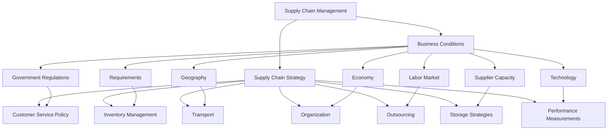

In today’s fast-paced economy, efficient supply chain management is crucial to ensure the smooth flow of goods and information from suppliers to consumers. This guide explores key components of warehouse management and logistics within the broader context of supply chain operations, detailing the strategies and elements necessary for effective management.

## Warehouse: The Foundation of Storage and Movement

Warehouse management is a critical element within logistics that focuses on the **reception, storage, and internal movement** of goods within a warehouse until they reach the final point of consumption. The main objectives of warehouse management include:

- **Receiving Goods**: Effective processes for receiving raw materials, semi-finished products, and finished goods ensure that products are tracked and accounted for from the point of entry.
- **Storage Optimization**: Warehouses store various goods, from raw materials to finished products, and an optimized layout helps streamline picking and shipping operations.
- **Internal Movement**: Moving products within the warehouse efficiently is essential for minimizing handling time and reducing errors.
- **Data Processing and Management**: As goods move in and out, data on inventory levels, product conditions, and operational workflows must be recorded and managed to maintain accuracy and support decision-making.

Warehouse management is not only about physical handling; it also involves **data management** to track products and ensure the information aligns with the business’s objectives. Effective warehouse processes support inventory control, reduce costs, and facilitate timely product availability, which is vital for meeting customer demand.

## Understanding Logistics in Supply Chain Management

Logistics is the backbone of supply chain operations, involving the **planning, implementation, and control** of the flow and storage of goods, services, and information. According to the Council of Supply Chain Management Professionals, logistics ensures that products move efficiently from the **point of origin** to the **point of consumption**, fulfilling customer requirements.

### Key Aspects of Logistics

1. **Material Management**: This involves handling the procurement and receipt of raw materials and semi-finished goods necessary for production. Material management ensures that the right materials are available at the right time, minimizing delays in the production process.
  
2. **Material Flow System**: Logistics also encompasses the planning and execution of material flow. This includes determining when and how to manufacture or purchase finished products to keep up with demand. A streamlined material flow system minimizes waste and ensures products are available for the next stage of the supply chain.

3. **Physical Distribution**: Finally, logistics involves the **physical distribution** of finished goods to end customers. Effective distribution strategies reduce transportation costs and improve delivery times, directly impacting customer satisfaction.

Logistics integrates these elements to create a cohesive and efficient flow of materials and information throughout the supply chain, supporting the organization's goals of responsiveness and cost-effectiveness.

## Supply Chain Management: Aligning Strategy with Business Conditions

Effective supply chain management (SCM) requires aligning **business conditions** with a coherent **supply chain strategy**. This alignment ensures that SCM adapts to external factors while meeting organizational objectives. Below is an analysis of these factors:

### 1. Business Conditions

The external environment significantly influences supply chain decisions. Key business conditions include:

- **Government Regulations**: Compliance with local and international regulations is vital for smooth supply chain operations.
- **Requirements**: Different markets and products may have specific requirements, necessitating tailored supply chain processes.
- **Geography**: Physical location impacts transportation routes, warehousing decisions, and overall logistics strategy.
- **Economy**: Economic factors, such as inflation and currency exchange rates, influence costs across the supply chain.
- **Labor**: Workforce availability and labor market conditions affect warehousing and transportation operations.
- **Supplier Capacity**: Supplier capabilities must align with demand and quality standards to maintain supply chain stability.
- **Technology**: Technological advancements enable more efficient supply chain processes, from real-time tracking to inventory management automation.

### 2. Supply Chain Strategy

To respond to business conditions effectively, companies develop a supply chain strategy that focuses on:

- **Customer Service Policy**: Defining service levels and strategies to ensure customer satisfaction and loyalty.
- **Inventory Management**: Optimizing stock levels to meet demand without incurring unnecessary holding costs.
- **Transport**: Implementing logistics systems that ensure timely delivery at minimal cost.
- **Outsourcing**: Utilizing third-party providers to manage specific functions, such as warehousing or distribution, to reduce operational complexity.
- **Storage Strategies**: Developing efficient storage solutions within warehouses to optimize space and improve order fulfillment speed.
- **Organization**: Establishing a robust organizational structure to support supply chain operations.
- **Performance Measurements**: Using KPIs and metrics to assess the supply chain’s effectiveness and make data-driven improvements.

The relationship between business conditions and supply chain strategy can be visualized as follows:

The above diagram illustrates that an adaptable supply chain strategy must consider external and internal conditions. For example, government regulations impact customer service policies, while geography influences transport and distribution methods.

## Infrastructure and Logistics Flow in Supply Chains

The infrastructure supporting a supply chain comprises **factories, warehouses, ports, transportation networks**, and **terminals**. This physical network connects suppliers with consumers, enabling the efficient movement of goods and information. 

In logistics, the flow of materials, data, and capital moves between **consumers and suppliers** to maintain a consistent supply of goods. Efficient logistics ensures that this flow remains cost-effective and responsive to customer needs.

{: width="700" height="300" }

---
Warehouse and logistics management are integral components of an efficient supply chain. Warehousing provides a stable base for storing and managing inventory, while logistics ensures the smooth flow of goods, data, and money between suppliers and consumers. Supply chain management unifies these functions under a strategic framework, aligning business conditions with operational needs.

As businesses face increased pressure to optimize costs and enhance customer satisfaction, effective warehouse management and logistics strategies have become critical. Companies that invest in these areas can achieve greater responsiveness, lower operational costs, and improved service levels, contributing to a competitive edge in today's complex market landscape.

By aligning infrastructure, business conditions, and logistics strategies, companies can create a resilient and adaptable supply chain capable of meeting customer expectations and responding to market demands.
