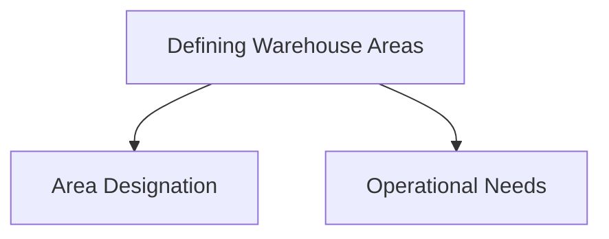
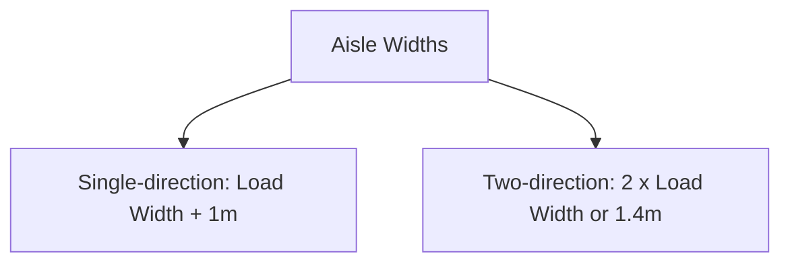
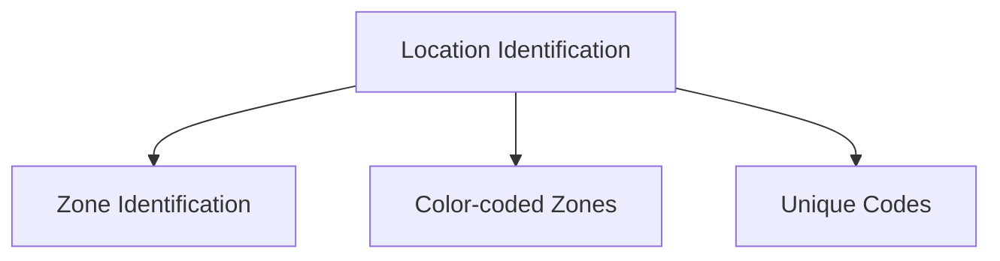
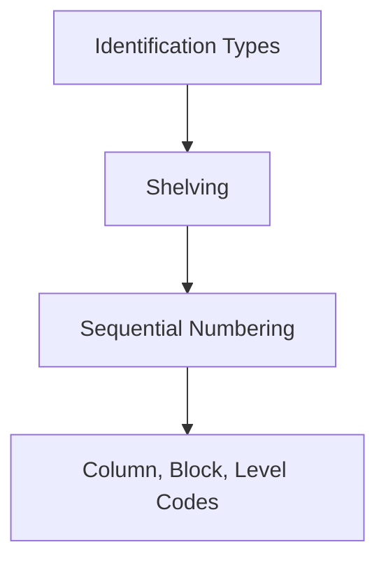
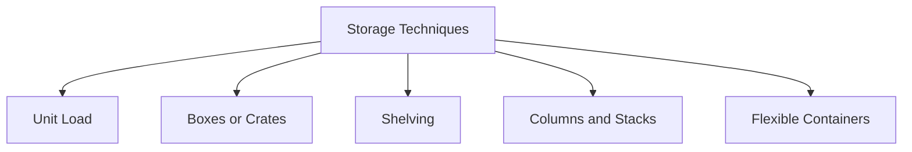
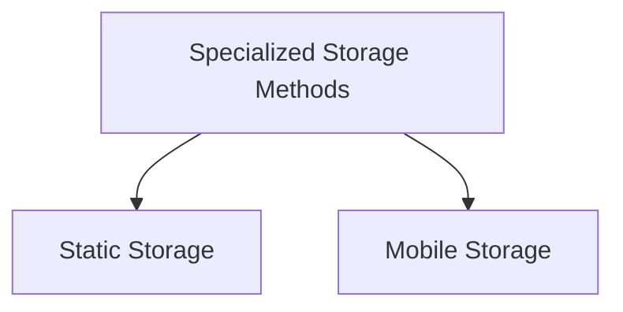
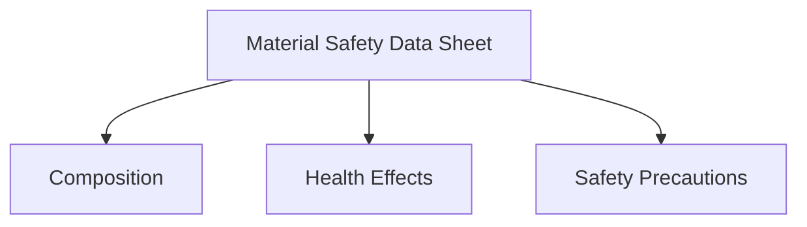

Efficient warehouse operations depend on a well-organized layout, clear identification methods, optimized storage techniques, and adherence to safety standards. This guide covers key concepts, including defining warehouse areas, aisle width requirements, location identification methods, storage techniques, and material safety data.

## Defining Warehouse Areas

Warehouse areas are designated based on the type of operations performed, transport methods, and personnel requirements. Proper area definition dictates the size of the warehouse and the dimensions of specific zones.

- **Area Designation**: All internal and external storage areas must be defined, and dimensions assigned to each based on their function.
- **Operational Needs**: Areas are designed to support specific operational requirements, such as storage, handling, and safety.

## Aisle Widths in Warehouses

Aisle widths are essential for allowing smooth movement within the warehouse, especially for equipment and vehicles.

- **Single-direction Aisles**: The width should be no less than the width of the equipment or load, plus an additional meter.
- **Two-direction Aisles**: Width should be at least twice the width of the equipment or 1.4 meters, whichever is larger.

## Location Identification in the Warehouse

Effective identification methods help staff locate and manage items efficiently.

1. **Zone Identification**: All zones within the warehouse should be clearly marked for easy recognition by authorized personnel.
2. **Color-coded Zones**: Commonly, zones are color-coded or marked with signs indicating specific areas.
3. **Unique Codes**: Each location within the warehouse has a unique code for clear distinction from other zones.

### Identification Types: Shelving

In the warehouse, shelves are identified using a sequential numbering system. Columns, blocks, and levels are marked with correlating codes, starting from the lower levels and ascending upwards. 

## Storage Techniques in Warehouses

Storage techniques vary depending on the type of goods, the frequency of movement, and safety requirements.

### Basic Storage Methods

1. **Unit Load**: Items stored as individual units.
2. **Boxes or Crates**: Commonly used for small items.
3. **Shelving**: For orderly storage of goods in an accessible way.
4. **Columns and Stacks**: Suitable for items that can be stacked safely.
5. **Flexible Containers**: Used for irregularly shaped items that need containment.

### Specialized Storage Methods

1. **Static Storage**: System where both the storage device and items remain stationary throughout the process.
2. **Mobile Storage**: Allows movement of storage devices while maintaining the stability of items within.

## Safety Data Sheet (SDS) and Material Safety

Warehouses often store various materials that require safety documentation. The **Material Safety Data Sheet (MSDS)** is essential for understanding the composition, potential health effects, and handling instructions for each material.

- **Composition**: Details the components and chemical makeup of the material.
- **Health Effects**: Includes potential acute and chronic health effects.
- **Safety Precautions**: Information on proper handling, storage, and disposal of the material.

---
Organizing a warehouse efficiently involves defining specific areas, establishing adequate aisle widths, implementing effective identification methods, and selecting appropriate storage techniques. Furthermore, maintaining safety through proper material data documentation is crucial for protecting both personnel and inventory. By adhering to these guidelines, warehouses can improve operational efficiency, reduce risks, and create a safer working environment. 

This holistic approach to warehouse management ensures that storage, movement, and handling of goods meet high standards, supporting the overall supply chain strategy.
