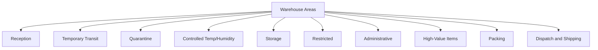
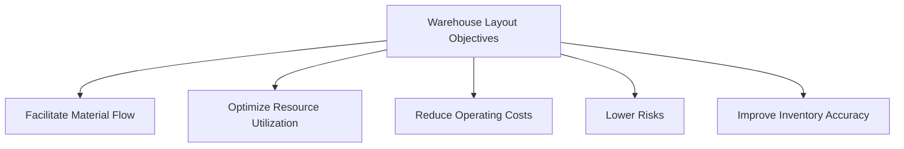
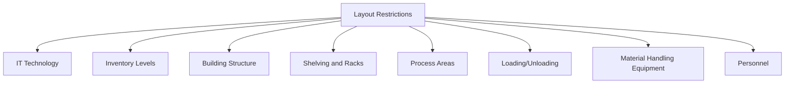
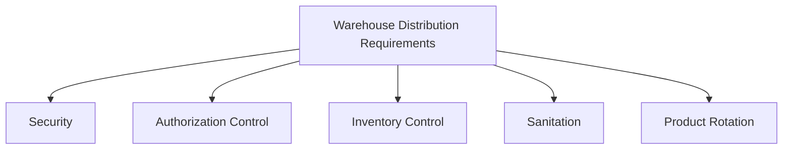
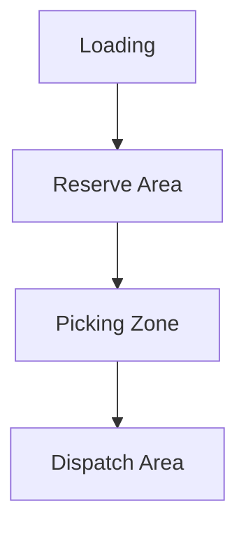
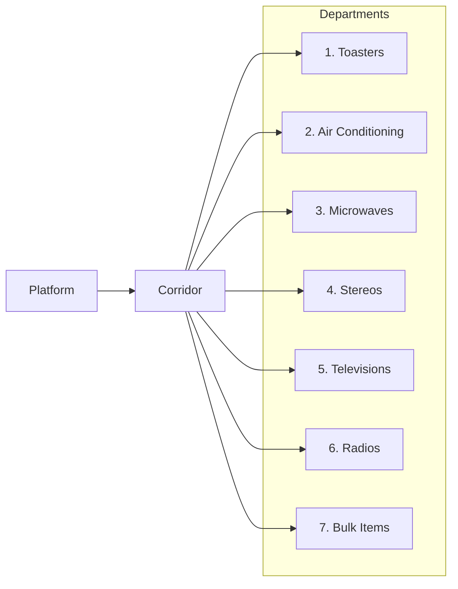

Warehouse layout and distribution play a critical role in optimizing the movement of goods, reducing operational costs, and meeting customer demands. This guide explores different warehouse areas, distribution objectives, and layout restrictions, providing a holistic view of how effective warehouse design supports overall efficiency.

## Key Areas of a Warehouse

A well-organized warehouse is divided into distinct zones, each with a specific function to support inventory flow and storage needs. These areas include:

1. **Reception**: The area where incoming goods are received and initial checks are performed.
2. **Temporary Transit**: Holding space for goods temporarily awaiting processing or movement.
3. **Quarantine**: Reserved for goods that need quality checks or hold for clearance.
4. **Controlled Temperature/Humidity**: Special storage areas for items that require specific environmental conditions.
5. **Storage**: Main area for inventory storage, including reserve and picking zones.
6. **Restricted**: Access-limited areas for high-value or sensitive items.
7. **Administrative**: Offices for managing warehouse operations and staff.
8. **High-Value Items**: Secure zones for expensive inventory.
9. **Packing**: Area where items are prepared for shipment.
10. **Dispatch and Shipping**: Final area for outgoing goods.

## Objectives of Warehouse Layout and Distribution

A well-planned warehouse layout aims to achieve several key objectives, each of which contributes to the overall efficiency of operations:

1. **Facilitate Material Flow**: Ensure smooth movement of goods from receiving to dispatch.
2. **Resource Utilization**: Optimize space, labor, and equipment usage.
3. **Reduce Operating Costs**: Minimize unnecessary steps and reduce travel time.
4. **Lower Risks**: Ensure safety and reduce the risk of damage or loss.
5. **Improve Inventory Accuracy**: Support better stock tracking and control.

## Restrictions Affecting Warehouse Layout

Designing an effective warehouse layout requires consideration of certain constraints. Key restrictions include:

1. **IT Technology**: Systems for inventory and order tracking.
2. **Inventory Levels**: Volume and type of goods stored.
3. **Building Structure**: Layout limitations imposed by the warehouse's physical structure.
4. **Shelving and Racks**: Storage equipment affecting accessibility.
5. **Process Areas**: Designated areas for specific operational processes.
6. **Loading and Unloading**: Areas for receiving and dispatching goods.
7. **Material Handling Equipment**: Machinery used for moving goods within the warehouse.
8. **Personnel**: Number and positioning of staff.

## Space Needs Assessment in Warehouse Distribution

To optimize space within the warehouse, it’s essential to quantify real needs based on various factors:

1. **Material Batches**: Determine the minimum and maximum levels of material batches.
2. **Entry/Exit Frequency**: Measure how often goods are moved in and out.
3. **Physical and Chemical Characteristics**: Account for any special handling requirements.
4. **Material Handling Methods**: Assess the equipment needed for transportation and storage.
5. **Process Sequence**: Follow a logical sequence of operations within the warehouse.

## Requirements for Efficient Warehouse Distribution

Effective distribution within a warehouse depends on meeting specific requirements, such as:

1. **Security**: Ensuring the safety of both employees and products.
2. **Authorization Control**: Following set rules and guidelines for access and movement.
3. **Inventory Control**: Facilitating easy inventory counting and verification.
4. **Sanitation**: Maintaining cleanliness and hygiene.
5. **Product Rotation**: Managing stock to prevent obsolescence.

## Example Layouts for Warehouse Distribution

### Basic Layout Design

In a basic warehouse layout, goods move in a straightforward path from **Reception** to **Storage** and finally to **Dispatch**. This design allows for efficient accumulation and consolidation of goods for order picking and dispatching.

### Optimized Zone Distribution

An optimized layout separates the warehouse into distinct zones like **Reserve Area** and **Picking Zone**, with defined paths for loading (Descarga) and dispatch (Expedición).

## Sample Distribution Exercise

In larger warehouse environments, departments may be organized based on area needs and traffic flow to optimize efficiency. For example, departments with high activity or larger space requirements are located closer to main corridors to reduce travel distances.

In this arrangement, departments are arranged along a main corridor to facilitate easy access. Each department’s space is determined based on frequency of access and size needs, ensuring that high-traffic areas are conveniently located.

---
Effective warehouse layout and distribution optimize the flow of goods, reduce operational costs, and support inventory accuracy. By dividing the warehouse into specific functional areas, meeting operational objectives, and understanding layout restrictions, businesses can create a streamlined and efficient environment. Thoughtful warehouse design not only enhances daily operations but also contributes significantly to overall supply chain performance.
