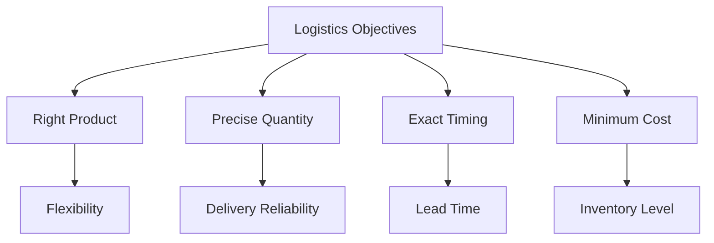
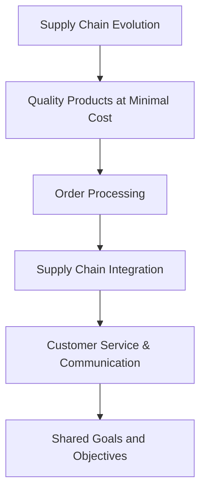
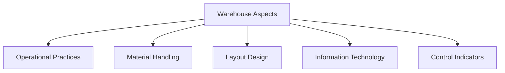
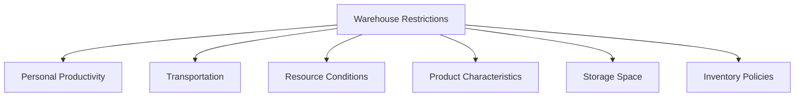
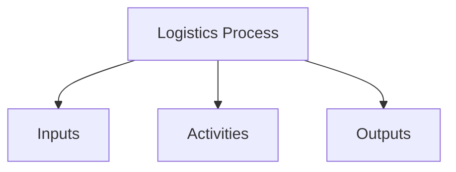
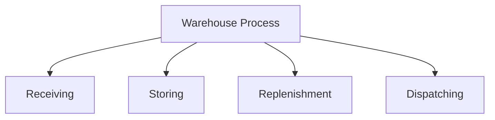
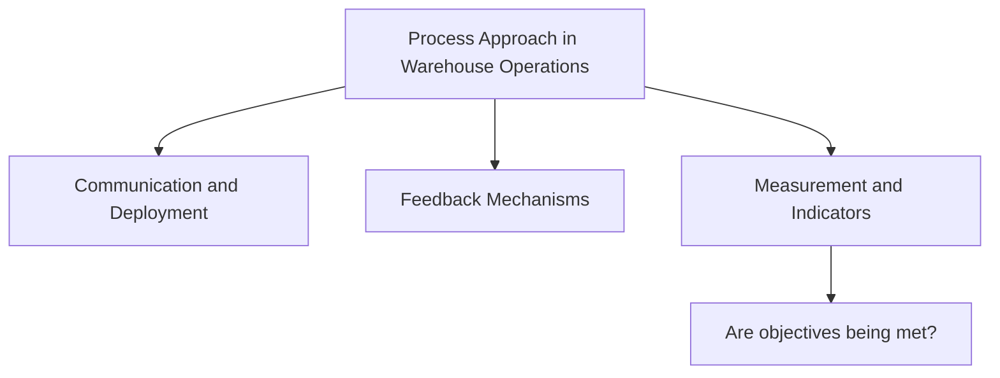

In a complex and ever-evolving supply chain landscape, companies aim to optimize warehouse processes and logistics objectives to ensure they meet customer needs efficiently. This post explores the primary goals of supply chain and logistics management, delves into warehouse processes, and discusses factors and restrictions that impact warehouse performance.

## The Goal of the Supply Chain

The **goal of the supply chain** is to convert a company’s operational processes into an efficient customer satisfaction mechanism. Instead of focusing on the performance of individual departments, the effectiveness of the entire supply chain as a cohesive unit takes precedence. An effective supply chain ensures that products reach customers promptly and efficiently, minimizing costs while maximizing quality and service.

## Objectives and Goals of Logistics

Logistics has specific objectives that focus on ensuring that the right product is delivered in the right quantity, at the right time, and at minimal cost. Here’s a breakdown of logistics objectives:

1. **Right Product**: Ensuring the correct product is available.
2. **Precise Quantity**: Maintaining accurate quantities to meet demand.
3. **Exact Timing**: Ensuring products arrive at the scheduled time.
4. **Minimum Cost**: Reducing costs without compromising quality.

These primary objectives lead to various metrics and goals that support logistics processes, such as **flexibility**, **reliability of delivery**, **lead time** management, and **inventory levels**. By focusing on these areas, logistics can optimize its operations to meet demand while controlling costs.

## Evolution of the Supply Chain

The supply chain is continuously evolving to meet changing business and customer needs. Key areas of evolution include:

- **Quality Products at Minimal Cost**: Striving for high-quality goods while keeping costs low.
- **Order Processing**: Streamlining order processing to improve efficiency.
- **Supply Chain Integration**: Enhancing integration across the supply chain to ensure a seamless flow from suppliers to customers.
- **Customer Service and Communication**: Improving customer engagement and maintaining clear communication channels.
- **Common Goals and Objectives**: Aligning the supply chain with common goals, which helps establish a cohesive approach to meeting market demands.

The evolution of the supply chain can be visualized as a process where each step builds on the previous one, moving from quality focus to shared objectives.

## Key Warehouse Aspects and Considerations

Efficient warehouse operations rely on various factors, including **operational practices, material handling, layout design, information technology, and control indicators**. Each factor contributes to maintaining optimal storage and retrieval processes, minimizing errors, and enhancing overall productivity.

1. **Operational Practices**: Standardizing procedures within the warehouse for consistency and efficiency.
2. **Material Handling**: Proper equipment and processes to move goods safely and effectively.
3. **Layout**: Designing the warehouse layout to facilitate easy access and efficient workflows.
4. **Information Technology**: Utilizing technology to monitor and control inventory, order processing, and stock levels.
5. **Control Indicators**: Implementing metrics to track warehouse performance, such as throughput, accuracy, and fulfillment rates.

## Restrictions Affecting Warehouse Operations

Various restrictions impact warehouse operations and logistics performance. These include:

- **Personal Productivity**: Efficiency of staff and their adherence to procedures.
- **Transportation**: Availability and efficiency of transport options for inbound and outbound goods.
- **Resource Conditions**: Types and conditions of resources available.
- **Product Characteristics**: Specific attributes of products that may require special handling.
- **Storage Space**: Availability and organization of storage areas.
- **Inventory Policies**: Guidelines for managing stock levels and reorder points.

## Defining and Understanding Processes in Logistics

In logistics, a **process** is defined as a series of interrelated activities that transform inputs into outputs. According to ISO 9000:2005, greater efficiency is achieved when activities and resources are managed as part of a unified process.

- **Inputs**: The resources, information, and goods entering the process.
- **Activities**: The tasks and operations conducted to transform inputs.
- **Outputs**: The final products or information resulting from the process.

The process-oriented approach in logistics helps organizations achieve better alignment between their strategic goals and operational activities.

## Warehouse Process Flow

Warehouse operations are broken down into key steps, from receiving to dispatching. Each phase involves handling information and careful planning to ensure efficiency and accuracy.

1. **Receiving**: Accepting goods and registering them in the inventory.
2. **Storing**: Placing goods in designated areas for easy access.
3. **Replenishment**: Moving products from storage to picking areas as demand arises.
4. **Dispatching**: Preparing orders and sending goods to customers.

## Process Approach in Warehouse Operations

The effectiveness of warehouse operations relies on the alignment of processes within the organization. Communication, deployment, and continuous feedback are essential to achieving warehouse objectives and meeting organizational goals.

- **Communication and Deployment**: Ensuring all departments understand their roles in the process.
- **Feedback Mechanisms**: Regular feedback to assess if objectives are met.
- **Measurement and Indicators**: Using performance indicators to monitor warehouse efficiency.

---
Warehouse and logistics management are essential components of a successful supply chain. By focusing on clear objectives, evolving the supply chain, managing warehouse operations effectively, and addressing restrictions, companies can streamline their logistics processes to better serve customers. Additionally, adopting a process-oriented approach ensures alignment between strategic goals and daily operations, making the supply chain a powerful driver of business success.

Through careful planning, efficient resource allocation, and continuous monitoring, companies can achieve a resilient supply chain that is capable of adapting to changing market demands.