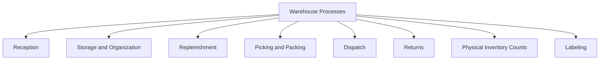
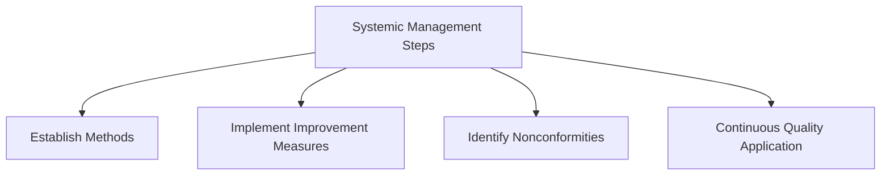
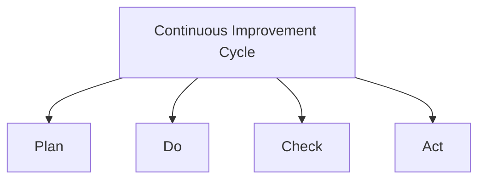
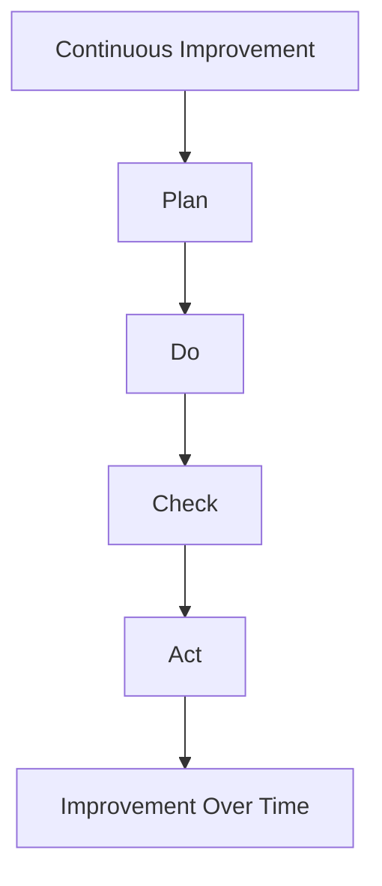
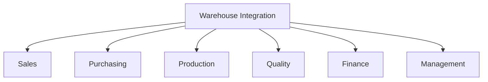

Efficient warehouse operations are a crucial component of any organization’s supply chain, supporting the seamless flow of goods, information, and resources. By adopting systemic management approaches, implementing continuous improvement practices, and understanding the relationships between warehouse functions and other departments, organizations can improve overall productivity and meet customer expectations.

## Warehouse Processes: Identifying Key Activities

Warehouse management encompasses several key processes, each designed to manage the flow of goods and information effectively. Identifying and streamlining these processes can lead to better inventory control, faster order fulfillment, and reduced operational costs.

### Primary Warehouse Processes

1. **Reception**: The process of receiving goods from suppliers and verifying their accuracy.
2. **Storage and Organization**: Allocating space for received goods and organizing them for easy access.
3. **Replenishment**: Moving items from bulk storage to picking areas as inventory depletes.
4. **Picking and Packing**: Preparing goods for dispatch by selecting and packaging the correct items.
5. **Dispatch**: Shipping orders to customers or other facilities.
6. **Returns**: Handling returned goods for restocking or processing.
7. **Physical Inventory Counts**: Regular checks to ensure inventory accuracy.
8. **Labeling**: Proper identification of items for easier tracking.



## Systemic Approach to Warehouse Management

A **systemic approach** to warehouse management involves treating all processes as interconnected parts of a whole. This approach emphasizes understanding and managing processes as a system to enhance organizational effectiveness and efficiency. 

### Key Components of a Systemic Approach

1. **Organization (ORG)**: Setting up a structured workflow and clear responsibilities within the warehouse.
2. **Documentation (DOCS)**: Maintaining accurate records of processes, inventory levels, and transactions.
3. **Resources (RECURSOS)**: Allocating the necessary resources, including staff, equipment, and technology.

```mermaid
graph TD
    A[Systemic Approach]
    A --> B[Organization (ORG)]
    A --> C[Documentation (DOCS)]
    A --> D[Resources (RECURSOS)]
    A --> E[Processes]
```

### Systemic Management Steps

1. **Establish Methods**: Define methods to measure process effectiveness.
2. **Implement Improvement Measures**: Apply strategies to enhance efficiency.
3. **Identify Nonconformities**: Recognize areas where performance deviates from targets.
4. **Continuous Quality Application**: Ensure consistent improvement in quality.



## Continuous Improvement in Warehouse Management

The **continuous improvement cycle** is a fundamental concept in warehouse management, involving four main steps:

1. **Plan**: Identify improvement areas and establish objectives.
2. **Do**: Implement changes aimed at improvement.
3. **Check**: Monitor and evaluate the results.
4. **Act**: Take corrective action based on evaluation to optimize processes further.



### Continuous Improvement Process Flow

This improvement cycle enables a warehouse to remain adaptive and responsive to changes, helping it meet evolving customer and business demands. Through iterative assessments and adjustments, the cycle drives the warehouse to higher performance levels over time.



## Integrating Warehouse Operations with Other Departments

The warehouse plays a crucial role in the supply chain, interacting with various departments to ensure smooth operations. Each department has its own expectations and requirements from the warehouse.

1. **Sales**: Expects timely order fulfillment to meet customer demand.
2. **Purchasing**: Relies on the warehouse for accurate inventory data to make purchasing decisions.
3. **Production**: Needs efficient material handling to support manufacturing schedules.
4. **Quality**: Depends on the warehouse to uphold standards in storage and handling.
5. **Finance**: Uses inventory data for cost control and financial planning.
6. **Management**: Requires performance insights to make strategic decisions.



---
Effective warehouse management requires a holistic approach that includes identifying core processes, adopting a systemic approach, and committing to continuous improvement. By following structured methods and aligning warehouse functions with other departments, organizations can enhance overall supply chain efficiency, reduce costs, and improve customer satisfaction. 

In a dynamic environment where customer demands and business needs are constantly evolving, focusing on warehouse optimization and embracing improvement strategies is essential for maintaining competitiveness and achieving long-term success.