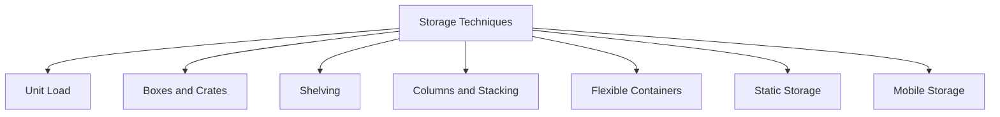
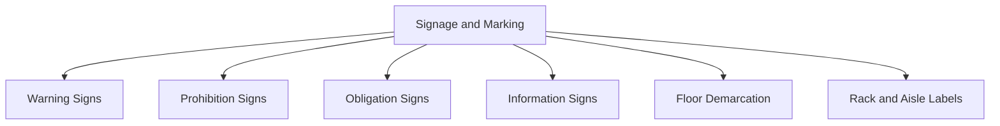
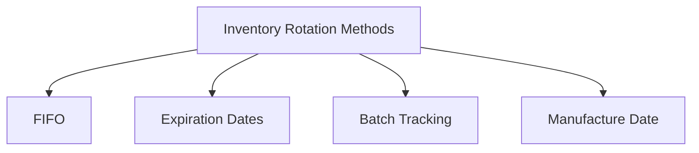

Warehouse management involves organizing storage, handling hazardous materials, implementing safety signage, and managing inventory efficiently. This comprehensive guide explores best practices for storage techniques, hazardous material management, signage requirements, and inventory rotation, which are all essential for maintaining a safe and efficient warehouse environment.

## Storage Techniques in Warehouses

Effective storage is foundational to warehouse management. Storage techniques vary depending on the type of items, required access, and safety considerations.

### Basic Storage Techniques

1. **Unit Load**: Storing items as individual units, often used for bulky or large items.
2. **Boxes and Crates**: Commonly utilized for small or fragile items that need containment.
3. **Shelving**: Efficient use of vertical space, allowing easy access and organization.
4. **Columns and Stacking**: Suitable for items that can be stacked safely to maximize space.
5. **Flexible Containers**: Ideal for irregularly shaped items or soft goods.

### Specialized Storage Techniques

- **Static Storage**: Both storage devices and items remain stationary throughout the process, providing a stable environment for delicate or hazardous items.
- **Mobile Storage**: While the items remain stable, the storage devices can move, allowing for greater flexibility and accessibility.

## Handling Hazardous Materials

Managing hazardous materials in a warehouse requires adherence to stringent storage and handling protocols. These materials include any items that may pose a risk due to **toxicity, flammability, explosiveness, reactivity, or radioactivity**. 

### Hazardous Material Classification

Hazardous materials are categorized into different classes based on their properties. Below are some common classifications:

- **Class 1**: Explosives
- **Class 2**: Gases
- **Class 3**: Flammable Liquids
- **Class 4**: Flammable Solids
- **Class 5**: Oxidizing Substances
- **Class 6**: Toxic and Infectious Substances
- **Class 7**: Radioactive Materials
- **Class 8**: Corrosive Substances
- **Class 9**: Miscellaneous Dangerous Goods

### Signage and Labeling

To ensure safety, warehouses must have clear signage for hazardous materials. These signs should indicate the type of hazard (e.g., flammable, toxic) and any handling precautions.

Each type of hazardous material should be clearly marked with a unique label that provides information about the hazard, handling instructions, and safety precautions.

## Signage and Marking in Warehouses

Signage and marking are critical for maintaining an organized and safe environment. Signs are used to label storage areas, identify hazardous materials, and provide safety information.

### Types of Signage

1. **Warning Signs**: Indicate potential dangers, such as flammable or toxic materials.
2. **Prohibition Signs**: Mark restricted activities (e.g., "No Smoking").
3. **Obligation Signs**: Require specific actions (e.g., "Wear Safety Gear").
4. **Information Signs**: Provide operational information (e.g., emergency exits, fire equipment).

### Marking and Demarcation

1. **Signs and Notices**: Post signs where emergency equipment, hazardous areas, or other essential safety equipment is located.
2. **Floor Demarcation**: Mark lanes with 10 cm wide yellow paint strips to define aisles, emergency access routes, and loading/unloading zones.
3. **Rack and Aisle Labels**: Ensure that all aisles and racks are marked clearly for easier navigation.

## Safety Standards and Compliance in Warehouses

Safety standards guide operations in a warehouse to prevent accidents and ensure smooth workflows. Adherence to these standards promotes a safe working environment for employees and minimizes risks associated with handling materials.

### Key Safety Standards

1. **Safety Rules**: Clear guidelines to prevent unsafe behavior or conditions.
2. **Risk Mitigation**: Instructions on preventing and managing potential risks.
3. **Emergency Preparedness**: Procedures for handling fires, spills, or other emergencies.
4. **Documentation**: Consistent documentation for compliance with industry and regulatory standards.

Warehouse standards are often customized to align with specific organizational needs and are a critical part of warehouse management.

## Inventory Rotation

Inventory rotation is vital for maintaining the quality and freshness of products, especially those with expiration dates. Proper rotation prevents inventory obsolescence and reduces waste.

### Rotation Methods

1. **First In, First Out (FIFO)**: Ensures older stock is used or shipped before newer stock.
2. **Expiration Dates**: Prioritize items close to expiration to avoid spoilage.
3. **Batch Tracking**: Use batch numbers for tracking inventory and rotation.
4. **Manufacture Date**: Arrange inventory based on production dates for freshness.

---
Effective warehouse management requires comprehensive knowledge of storage techniques, hazardous material handling, signage and safety standards, and inventory rotation practices. By implementing these best practices, warehouses can ensure a safe, efficient, and organized environment, ultimately supporting smooth operations and compliance with industry regulations. Proper signage, adherence to safety protocols, and regular inventory checks enhance both operational efficiency and workplace safety, fostering a resilient warehouse structure.

This guide provides a foundation for establishing and maintaining high standards in warehouse management. Implementing these strategies will help create an organized, safe, and efficient space that meets regulatory requirements and operational goals. 
