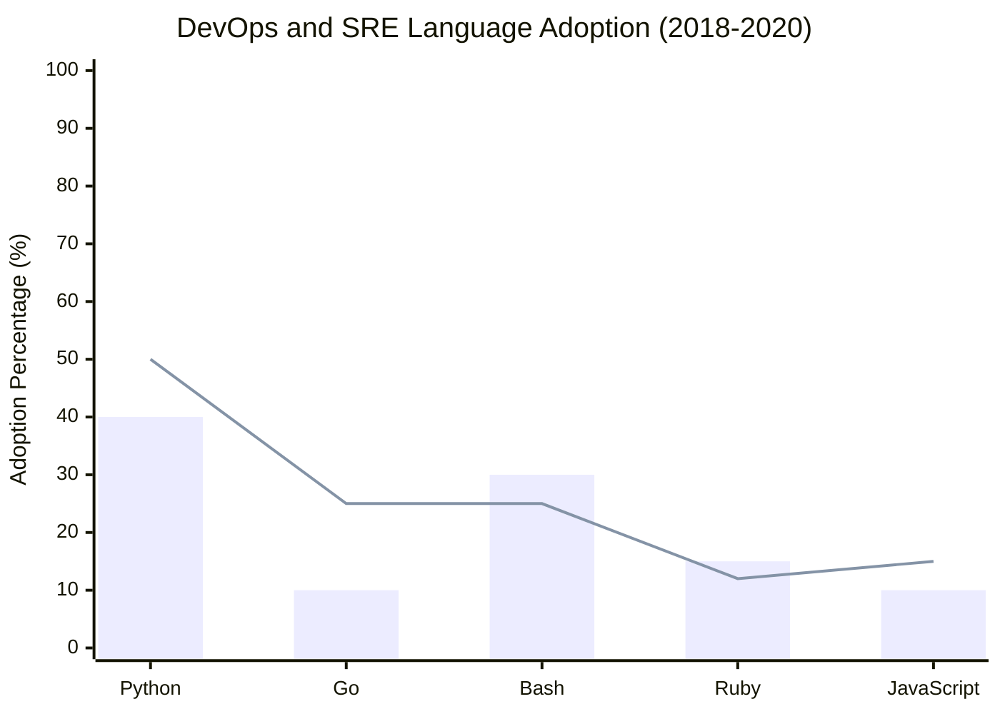

Aspiring DevOps professionals often wonder which programming language they should learn to further their career. With many languages to choose from, it’s crucial to focus on those that are widely adopted and highly relevant to the DevOps ecosystem. This guide will help you navigate through the options, with a special focus on Python and Go.

## Programming Languages in DevOps

In the DevOps culture, languages that enable automation, configuration management, and cloud interaction are particularly valuable. Python and Go have risen to prominence in this area due to their ease of use, scalability, and extensive support for DevOps tools and practices.

### Python

Python is a high-level, interpreted language known for its readability and extensive support in the DevOps community. As a versatile language, Python allows professionals to create scripts for automating tasks and developing tools for infrastructure management. Here’s why Python is a favorite in DevOps:

1. **Cross-Platform Compatibility**: Python works seamlessly across various operating systems, making it an excellent choice for projects involving multiple environments.
2. **Extensive Libraries and Frameworks**: Python offers powerful libraries for automation, such as Ansible and SaltStack, which are essential for configuration management.
3. **Cloud-Friendly**: Python is often used to build command-line interfaces (CLI) for cloud services like AWS, Azure, and Google Cloud Platform.
4. **Ease of Learning**: Its simple syntax and readability make Python accessible, even for those new to programming.

Overall, Python is an outstanding choice for those looking to get started in DevOps. It is ideal for scripting, configuration, and automation tasks.

### Go (Golang)

Go, or Golang, is a statically typed language developed by Google that has gained traction in DevOps for its performance and efficiency. It’s particularly popular for building scalable tools and microservices. Here’s what makes Go appealing:

1. **High Performance**: Go is known for its speed and efficiency, making it a preferred choice for tasks that require high concurrency.
2. **Scalability**: Go’s built-in support for concurrency makes it suitable for building highly scalable services and tools.
3. **Robust Tooling**: Go has a strong set of tools for testing and deployment, which align well with DevOps practices.
4. **Adoption in Cloud-Native Projects**: Tools like Docker and Kubernetes are built with Go, highlighting its importance in cloud-native environments.

While Python and Go are popular, remember that the best language depends on your specific needs and the tools you’ll be using. Explore both options and see which one resonates with your career goals and DevOps projects.

### Adoption Trends: Python and Go in DevOps (2018-2020)

To provide context on the popularity of these languages, here’s a visual representation of the trend in Python and Go adoption among DevOps professionals from 2018 to 2020.

**Python** saw steady adoption, holding strong with adoption values represented at 40% in one set and 50% in another, affirming its position as a popular choice for DevOps tools and automation. Go demonstrated substantial growth, with adoption values shown as 10% and rising to 25%, highlighting its increasing use in cloud-native technologies and infrastructure projects.

