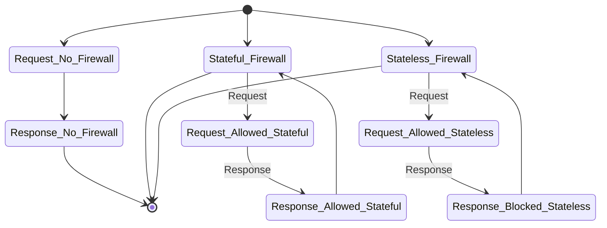

In AWS, Security Groups and Network Access Control Lists (NACLs) form the bedrock of network security. These components are essential for ensuring the protection of resources in a Virtual Private Cloud (VPC). Understanding their differences is crucial for DevOps engineers and programmers who need to design robust and secure cloud infrastructures. This blog post aims to provide a comprehensive comparison of Security Groups and NACLs, explaining their roles, how they differ, and the best practices for implementing each in your AWS environment.

## Overview of Security Groups and NACLs

Security Groups and NACLs serve as the fundamental building blocks for controlling inbound and outbound traffic within your AWS environment. However, they operate at different levels and serve distinct purposes.

| Feature                | Security Groups                             | Network Access Control Lists (NACLs)          |
|------------------------|--------------------------------------------|----------------------------------------------|
| **Scope of Application** | Applies at the instance level               | Applies at the subnet level                   |
| **Statefulness**       | Stateful, keeps track of request-response pairs | Stateless, treats every request independently |
| **Default Rules**      | Default allow rules for traffic unless denied | Default deny rules unless specifically allowed |
| **Order of Rules**     | No specific order of rules                  | Numbered list, processed in sequence          |
| **Blocking Traffic**   | Blocks traffic at the instance level       | Blocks traffic at the subnet level            |
| **Impact on Network Performance** | Limited impact due to instance-level operation | Can affect network performance due to subnet-level control |

*[AWS Security Groups Documentation](https://docs.aws.amazon.com/managedservices/latest/userguide/about-security-groups.html)*

## Key Differences Explained

### 1. Scope of Application
- **Security Groups** are associated with specific instances within a VPC, meaning they control the flow of traffic directly to and from those instances. This allows for more granular control over each instance.
  
- **NACLs**, on the other hand, operate at the subnet level. They govern all traffic entering and exiting the subnet, thus affecting all instances within that subnet.

**Example**: If you need to allow HTTP and HTTPS traffic to a particular web server, a Security Group would be used. Conversely, if you want to restrict access to an entire application tier within a VPC, a NACL would be more appropriate.

### 2. Stateful vs Stateless
- **Security Groups** are stateful. This means that once an incoming request is allowed, the response is automatically allowed without requiring additional rules. This simplifies the management of rules for many common network operations.

- **NACLs** are stateless, requiring explicit rules for both incoming and outgoing traffic. If an inbound request is allowed, a corresponding outbound rule must be set to allow the response.

**Technical Insight**: The stateful nature of Security Groups is particularly advantageous for managing response traffic, as it reduces the need for maintaining separate outbound rules for each inbound rule. On the other hand, NACLs provide greater control over every aspect of network traffic but require more complex configurations to achieve similar results.

*[NACLs vs Security Groups - AWS](https://docs.aws.amazon.com/vpc/latest/tgw/tgw-nacls.html)*

## Default Rules and Traffic Blocking

### 1. Default Rules
- **Security Groups** come with default settings that allow all outbound traffic. Incoming traffic is denied unless specific rules are defined to allow it.

- **NACLs** are configured with a default rule that denies all inbound and outbound traffic, providing a strict baseline that must be explicitly adjusted to allow required traffic.

### 2. Blocking Traffic
- **Security Groups** can block unwanted traffic at the instance level. For instance, you can deny all IPs except for a specific trusted range to enhance security for sensitive instances.
  
- **NACLs** block traffic at the subnet level, meaning that any rule applied here will affect all instances within that subnet. This can be useful for maintaining consistent security policies across multiple instances without configuring each one individually.

| Feature                  | Security Groups                        | NACLs                                        |
|--------------------------|----------------------------------------|----------------------------------------------|
| **Blocking Level**       | Instance-level                         | Subnet-level                                 |
| **Order of Processing**  | No specific order, rules evaluated collectively | Sequential based on rule number               |

### Practical Example
Consider a scenario where you need to provide internet access to an EC2 instance while maintaining strict security. You would configure a Security Group to allow HTTP/HTTPS traffic, while a NACL could be used to restrict traffic for all instances in the subnet to specific IP addresses.

*[AWS NACL Documentation](https://docs.aws.amazon.com/elasticloadbalancing/latest/application/load-balancer-update-security-groups.html)*

## Order of Rules and Network Performance

### 1. Order of Rule Evaluation
- **Security Groups** do not have a specific order for rule evaluation; all rules are processed collectively to determine whether traffic is allowed or denied.

- **NACLs** utilize a numbered list, evaluating rules in ascending order. This means that if a traffic rule matches early in the list, subsequent rules will not be evaluated.

**Performance Considerations**: The order in which NACL rules are evaluated can have significant performance implications, especially in complex network configurations where multiple conditions must be checked sequentially. Security Groups, being instance-specific, typically have a negligible impact on performance because they don’t have to evaluate rules in sequence.

| Feature                  | Security Groups                        | NACLs                                        |
|--------------------------|----------------------------------------|----------------------------------------------|
| **Network Performance Impact** | Low impact due to instance-specific control | Higher potential impact due to subnet-wide rule processing |

Understanding the differences between AWS Security Groups and Network Access Control Lists (NACLs) is fundamental for constructing a secure and efficient cloud environment. Security Groups provide stateful security at the instance level, ideal for controlling access to individual resources, whereas NACLs offer stateless control over an entire subnet, useful for implementing broad security policies.

Both Security Groups and NACLs play pivotal roles in AWS security architecture, and leveraging their features effectively can significantly enhance the resilience and security of your AWS deployments. Choosing between them—or deciding how to use them together—depends on the level of control, the scope of application, and performance considerations that are relevant to your specific use case.

For a hands-on guide to configuring Security Groups and NACLs, check out the comprehensive tutorial [AWS Security Groups vs Network ACLs](https://www.youtube.com/watch?v=ttc0b2NZTV0). This resource provides an in-depth step-by-step explanation, complete with practical examples.
