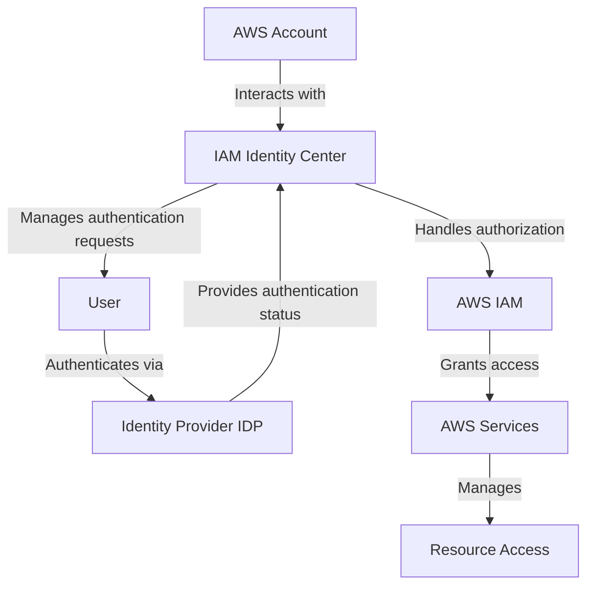

In the world of cloud computing, security is paramount. Understanding the intricacies of Identity and Access Management (IAM) is crucial. AWS IAM is the foundation of AWS's security framework, providing robust tools for authentication and authorization. In this blog post, we will explore how IAM works, including the key roles played by the IAM Identity Center, Identity Providers (IDPs), and the relationship between authentication and resource access. Our discussion will be enhanced by diagrams and detailed examples that will help you visualize these processes and understand how to implement them in practice.

## Introduction to AWS IAM: Authentication and Authorization

AWS Identity and Access Management (IAM) forms the cornerstone of secure interaction within AWS. It is responsible for managing user identities, defining their permissions, and ensuring secure access to AWS services. IAM's features for both authentication and authorization are designed to streamline user management while maintaining robust security.

### IAM Identity Center and its Role

The IAM Identity Center serves as the control point that orchestrates user authentication across multiple AWS accounts. It simplifies user management by integrating Single Sign-On (SSO) mechanisms and facilitating collaboration through Identity Providers like Microsoft Active Directory or third-party solutions. Below, we break down the major components of IAM as part of the authentication and authorization journey.

#### AWS IAM Authentication and Authorization Flow

### Explaining the Elements of IAM Flow

#### AWS Account

An AWS account serves as the foundation for all services and resources. Within this context, administrators configure IAM policies, assign roles, and manage overall cloud security.

#### IAM Identity Center

The IAM Identity Center is responsible for orchestrating authentication requests and managing access across multiple AWS accounts. This centralized hub integrates with external IDPs, ensuring streamlined and secure user authentication.

#### User and Authentication Request

A user attempting to log in to an AWS service sends an authentication request to the IAM Identity Center. For example, a system administrator logging in to manage EC2 instances sends credentials to be verified by the IAM system.

#### Identity Provider (IDP)

Identity Providers, such as Microsoft Active Directory or other third-party systems, validate the user's credentials using protocols like SAML 2.0. Once validated, the authentication status is communicated back to the IAM Identity Center.

#### AWS IAM for Authorization

After authentication, AWS IAM determines the specific permissions for the user. It enforces policies through IAM roles, deciding which AWS services the user can access. For instance, a developer might have read-only access to S3 buckets but full administrative rights for RDS databases.

#### AWS Services and Resource Access

IAM-defined permissions enable authorized users to interact with AWS services, such as launching an EC2 instance or modifying an RDS database. IAM policies ensure that these interactions remain secure and compliant with organizational security standards.

### Examples in Real-World Context

- **User Authentication Example**: An employee logs into an AWS environment using corporate credentials that are authenticated through IAM Identity Center integrated with the company's Active Directory.
- **Authorization Example**: A developer with a specific IAM role can access designated S3 buckets for data operations, while other resources, like EC2 instances, remain restricted.
- **Resource Access Example**: A user authorized through IAM interacts with an S3 bucket—downloading, uploading, or deleting files—based on their assigned permissions.

## Authentication vs Authorization - Key Differences and Practices

### Understanding Authentication

**Authentication** is the process of verifying the identity of users attempting to access AWS services. AWS IAM Identity Center facilitates this by connecting with IDPs, providing a seamless and secure login process for employees and partners.

- Authentication is a critical first step in securing access. Only after a user’s identity is validated can they move to request resource access.
- To enhance security, AWS supports multi-factor authentication (MFA), which provides an additional layer of protection against unauthorized access.

### Understanding Authorization

**Authorization** occurs once authentication is complete. IAM roles and policies define what actions an authenticated user can perform within AWS.

- Role-based access control (RBAC) is a commonly adopted strategy within AWS IAM to define user roles and limit permissions to the minimum needed for the role.
- IAM policies are written in JSON, defining the actions (e.g., `s3:GetObject`) that are allowed or denied for each user or service.

## Best Practices for Authentication and Authorization in AWS

### Implementing Principle of Least Privilege

IAM’s authorization features are designed to minimize risk by allowing administrators to follow the **Principle of Least Privilege**. Users and systems should have only the permissions they need to perform their functions—nothing more.

- Regularly review and audit IAM permissions to ensure users do not have unnecessary access rights.
- Implement tags and resource-based policies to further limit and organize access.

### Using Multi-Factor Authentication (MFA)

Adding MFA is a practical and efficient way to strengthen security within AWS IAM. All privileged accounts should require MFA to mitigate risks associated with compromised passwords.

### Monitoring and Auditing IAM Usage

Using tools like **AWS CloudTrail** and **AWS Config** can help track changes made in IAM, identify risks, and audit who accessed what services at any given time.

### Tabular Representation of Best Practices

| Practice                            | Description                                               | Benefits                            |
|-------------------------------------|-----------------------------------------------------------|-------------------------------------|
| Principle of Least Privilege        | Only grant users the permissions they need                | Minimizes security risks            |
| Enable Multi-Factor Authentication  | Use MFA for critical user accounts and services           | Adds an extra layer of security     |
| Regular IAM Policy Reviews          | Audit and update IAM policies periodically                | Maintains up-to-date access control |
| Role-Based Access Control (RBAC)    | Assign permissions based on defined roles and responsibilities | Simplifies access management      |
| AWS CloudTrail Monitoring           | Track changes in IAM and service usage                    | Improves visibility and traceability|

AWS IAM is a powerful tool in managing and securing access to your AWS resources. By understanding the roles of the IAM Identity Center, Identity Providers, and IAM policies, you can establish a secure environment that adheres to best practices in cloud security. As a DevOps engineer, it’s essential to understand both the authentication process—validating user identity—and the authorization process—determining what authenticated users can do. Together, these mechanisms protect your AWS resources from unauthorized access, ensuring a robust and secure infrastructure.

---

To learn more about IAM roles, best practices, and security management within AWS, consider exploring [AWS Identity and Access Management](https://aws.amazon.com/iam/) and the [AWS Well-Architected Framework](https://aws.amazon.com/architecture/well-architected/). These resources provide extensive knowledge for crafting secure, scalable, and efficient cloud solutions.