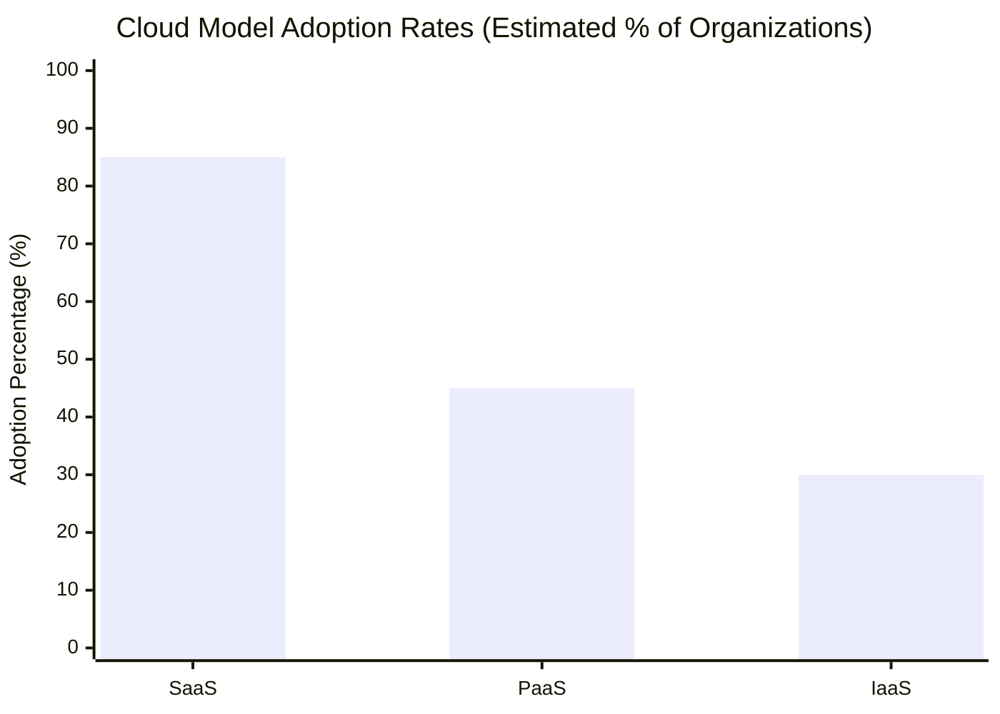

Cloud computing’s versatility is showcased through three primary service models: **Software as a Service (SaaS)**, **Platform as a Service (PaaS)**, and **Infrastructure as a Service (IaaS)**. Each model provides unique benefits for businesses, from on-demand software applications to scalable infrastructure solutions. In this post, we’ll explore these models through practical examples and discuss real-world cases like WikiLeaks and Google Cloud Connect to highlight both the advantages and challenges of cloud adoption.

---

## Understanding SaaS, PaaS, and IaaS with Examples

| **Cloud Model**                    | **Description**                                                                                                                                                 | **Examples**                           |
|------------------------------------|-----------------------------------------------------------------------------------------------------------------------------------------------------------------|----------------------------------------|
| **Software as a Service (SaaS)**   | Provides software applications over the internet, eliminating the need for local installation. Users access SaaS via a web browser.                             | Microsoft Office 365, Salesforce       |
| **Platform as a Service (PaaS)**   | Offers an environment for application development and deployment without managing underlying infrastructure, ideal for efficient application building.         | Google App Engine, Heroku              |
| **Infrastructure as a Service (IaaS)** | Delivers virtualized computing resources, allowing organizations to rent IT infrastructure like servers and storage without owning physical hardware.            | Amazon Web Services (AWS), Google Cloud|

### SaaS: Simplifying Software Access

**SaaS** enables users to run applications directly from the cloud, removing the need for installation and minimizing maintenance. For example, **Microsoft Office 365** provides web-based productivity tools like Word, Excel, and PowerPoint, accessible from any device with internet connectivity.

### PaaS: A Development Platform

With **PaaS**, developers can build and deploy applications in a managed environment. **Google App Engine** offers a scalable platform for developers to host applications without managing hardware, allowing them to focus solely on development.

### IaaS: Infrastructure On Demand

**IaaS** enables businesses to rent IT infrastructure without investing in physical servers. With **AWS**, organizations can scale resources according to demand, enhancing flexibility and reducing hardware maintenance.

---

## Challenges in Cloud Computing: The WikiLeaks Example

Cloud computing’s flexibility also presents challenges, particularly regarding content control and dependency on service providers. In 2010, **WikiLeaks** encountered issues with **Amazon Web Services (AWS)**, which suspended its hosting services for allegedly violating terms. This example illustrates the risks organizations face when using third-party cloud services, as providers can unilaterally enforce terms that may impact content availability.

---

## Google Cloud Connect: Integrating Cloud and Desktop Applications

**Google Cloud Connect** was a plugin that enabled users of Microsoft Office to save and sync their documents with **Google Docs** (now Google Drive). This tool offered collaborative editing, offline functionality, and version control, fostering teamwork across distributed locations. Though discontinued in 2013, Google Cloud Connect was a precursor to modern cloud-collaboration tools like Google Workspace.

---

## Adoption Rates of Cloud Models

The following chart displays estimated adoption rates of SaaS, PaaS, and IaaS among organizations:

---
Cloud models like SaaS, PaaS, and IaaS have revolutionized the way organizations operate, enabling on-demand access to software, development platforms, and infrastructure. However, incidents like WikiLeaks’ experience with AWS demonstrate the importance of carefully evaluating cloud dependencies. By understanding these models, businesses can make informed decisions to leverage cloud computing effectively while remaining aware of potential limitations.
