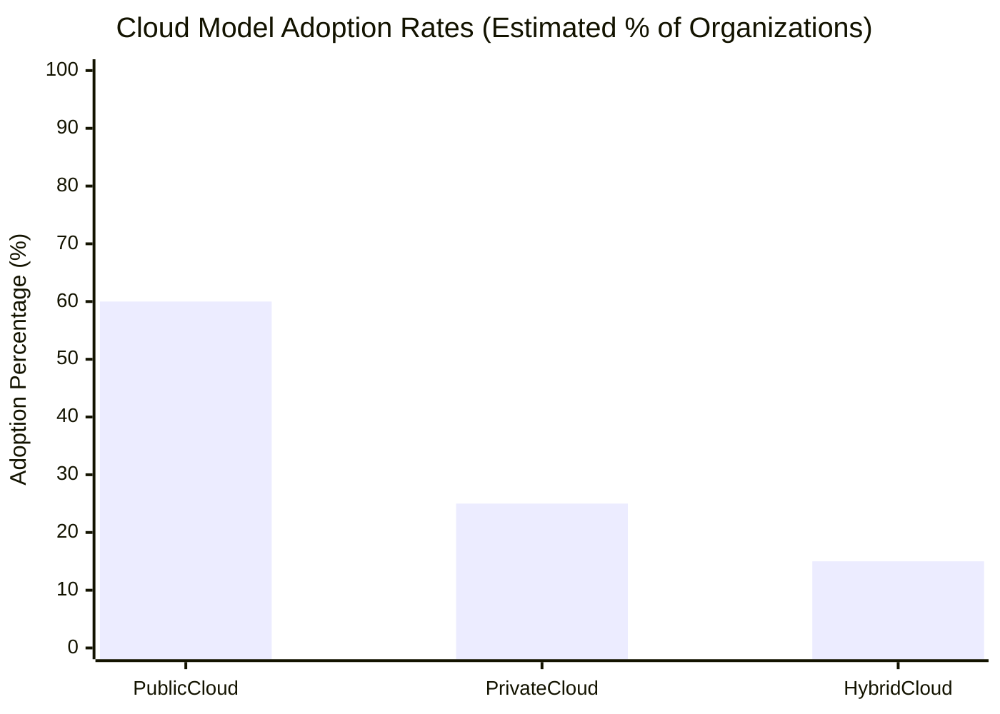

Choosing the right cloud model is critical for organizations seeking to optimize IT resources, scalability, and security. Each cloud model—public, private, and hybrid—offers unique benefits and limitations. This post provides a comparative analysis to help businesses select the model that best aligns with their needs.

---

## Comparative Advantages and Disadvantages of Cloud Models

| **Cloud Model**  | **Advantages**                                                                                                                                                           | **Disadvantages**                                                                                                                   |
|------------------|---------------------------------------------------------------------------------------------------------------------------------------------------------------------------|--------------------------------------------------------------------------------------------------------------------------------------|
| **Public Cloud** | - **Economy of Scale**: Low initial costs with a pay-as-you-go model. - **Ease of Implementation**: Quick setup, ideal for fast deployment. - **Scalability**: Near-infinite resources for growing demand. | - **Less Control**: Limited control over the infrastructure. - **Security Concerns**: Potential risks due to shared infrastructure. - **Vendor Lock-In**: Switching providers can be challenging. |
| **Private Cloud**| - **Exclusive Control**: Infrastructure dedicated to one organization, ensuring high control. - **Enhanced Security**: Optimal for sensitive data, meeting strict regulatory standards. - **Customization**: Tailored to specific requirements. | - **High Initial Cost**: Significant upfront investment in hardware and software. - **Limited Scalability**: Scaling constrained by available resources. - **Expertise Requirement**: Requires in-house technical skills. |
| **Hybrid Cloud** | - **Flexibility**: Combines scalability of public cloud with the security of private cloud. - **Cost Optimization**: Use public cloud for non-sensitive data to reduce costs. - **Disaster Recovery**: Improved backup and recovery capabilities. | - **Complex Management**: Requires integration across multiple platforms. - **Data Security Risks**: Higher risk if integration isn’t managed properly. - **Potential Hidden Costs**: Unforeseen costs in integration and maintenance. |

---

## Visualizing Cloud Model Usage Trends

The following graph illustrates the approximate adoption rates of cloud models among organizations in recent years:

---

## Choosing the Right Cloud Model

Each cloud model suits different use cases depending on an organization’s priorities, such as scalability, control, and data sensitivity.

### 1. [**Public Cloud**:](https://gaaspkm.online/posts/public-cloud/) Ideal for businesses prioritizing cost savings and scalability, particularly for non-sensitive data.
   - **Example**: Retail businesses using public clouds to handle peak season traffic.

### 2. [**Private Cloud**:](https://gaaspkm.online/posts/private-cloud/) Suitable for industries that require high data security and regulatory compliance.
   - **Example**: Financial services companies managing sensitive client data.

### 3. [**Hybrid Cloud**:](https://gaaspkm.online/posts/hybrid-cloud/) A balanced solution for organizations needing both secure, private environments and scalable resources.
   - **Example**: Healthcare providers storing patient data privately while utilizing public clouds for non-sensitive tasks.

---
Selecting the right cloud model requires a careful evaluation of business needs, budget, and data sensitivity. Public clouds provide flexibility and cost savings, while private clouds offer high control and security. The hybrid cloud, combining both, offers a versatile approach, balancing security with scalability. By understanding these factors, organizations can make informed decisions to optimize their IT infrastructure.

## References

1. [Gartner Cloud Computing Reports and Insights](https://www.gartner.com/en/information-technology/insights/cloud-computing)
2. [Flexera: State of the Cloud Report](https://www.flexera.com/blog/cloud/cloud-computing-trends-flexera-2023-state-of-the-cloud-report/) 
3. [IDC Cloud Research](https://www.idc.com/getdoc.jsp?containerId=IDC_P33269)  
4. [RightScale (by Flexera): State of the Cloud Report 2020](https://resources.flexera.com/web/pdf/report-rightscale-2020-state-of-the-cloud-report.pdf) 
