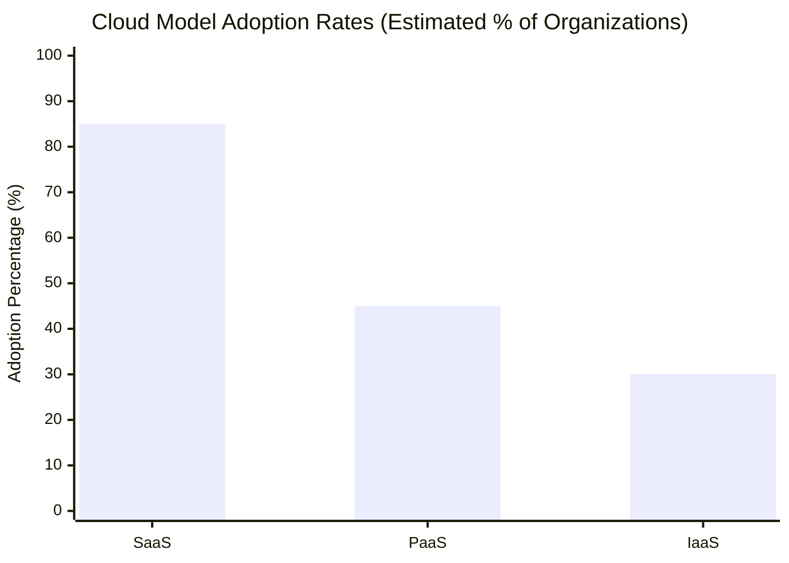

Here's a structured blog post on cloud models and their real-world applications, based on the document's content, with clear tables and illustrations.

---

# Real-World Applications of Cloud Models: SaaS, PaaS, and IaaS

## Introduction

Cloud computing offers versatile models tailored to various needs: **Software as a Service (SaaS)**, **Platform as a Service (PaaS)**, and **Infrastructure as a Service (IaaS)**. These models empower businesses to choose solutions that best fit their operational goals, from accessing software over the internet to developing custom applications without managing underlying infrastructure.

---

## Understanding Cloud Models with Examples

| **Cloud Model**          | **Description**                                                                                                                                                             | **Examples**                                      |
|--------------------------|-----------------------------------------------------------------------------------------------------------------------------------------------------------------------------|---------------------------------------------------|
| **Software as a Service (SaaS)**  | Provides access to software applications via the internet, eliminating the need for local installations. Users can access SaaS from a web browser.                     | Microsoft Office 365, Salesforce                   |
| **Platform as a Service (PaaS)**  | Offers an environment for developers to build, deploy, and manage applications without handling infrastructure. Ideal for application development and management.     | Google App Engine, Heroku                          |
| **Infrastructure as a Service (IaaS)** | Provides virtualized computing resources, allowing businesses to rent servers, storage, and network capabilities. Organizations maintain control over their IT infrastructure. | Amazon Web Services (AWS), Google Cloud Platform  |

### SaaS: Simplifying Software Access

SaaS enables users to run applications directly from the cloud, removing the need for installation and minimizing maintenance efforts. **Microsoft Office 365** is a popular example, allowing users to access productivity tools like Word, Excel, and PowerPoint online.

### PaaS: A Developer’s Playground

With PaaS, developers gain an integrated environment to build and deploy applications without managing servers. **Google App Engine** exemplifies this model, providing a scalable platform for developers to host applications.

### IaaS: Virtual Infrastructure on Demand

IaaS allows organizations to rent the IT infrastructure they need without owning physical hardware. With **AWS**, businesses can scale their resources up or down, meeting dynamic demand without a permanent commitment to hardware.

---

## Challenges with Cloud Computing: The WikiLeaks Example

Cloud computing isn’t without challenges, especially regarding content control and provider dependency. In 2010, **WikiLeaks** faced an issue with **Amazon Web Services (AWS)**, which suspended its hosting services for WikiLeaks, citing a violation of terms. AWS claimed WikiLeaks stored unauthorized content, potentially endangering lives. This incident highlights the risks organizations face when relying on third-party providers that may enforce unilateral decisions based on their policies.

---

## Case Study: Google Cloud Connect

**Google Cloud Connect** was a tool that allowed users of Microsoft Office to save and sync their documents with **Google Docs** (now Google Drive). This plugin enabled collaborative work, offline editing, and version control, making it a useful tool for business teams. Though discontinued in 2013, Google Cloud Connect was an early step in integrating office software with cloud storage and collaboration tools.

---

## Visualizing Cloud Model Adoption Rates

The graph below illustrates the estimated adoption rates of cloud models among organizations.

---
Understanding the practical applications of cloud models helps organizations select the most appropriate solution for their needs. SaaS provides ready-to-use applications, PaaS simplifies development, and IaaS offers customizable infrastructure. However, cases like WikiLeaks underscore the importance of evaluating risks associated with provider dependency and content control in cloud environments. 

## References

1. [Gartner Cloud Computing Reports and Insights](https://www.gartner.com/en/information-technology/insights/cloud-computing)
2. [Flexera: State of the Cloud Report](https://www.flexera.com/blog/cloud/cloud-computing-trends-flexera-2023-state-of-the-cloud-report/) 
3. [IDC Cloud Research](https://www.idc.com/getdoc.jsp?containerId=IDC_P33269)  
4. [RightScale (by Flexera): State of the Cloud Report 2020](https://resources.flexera.com/web/pdf/report-rightscale-2020-state-of-the-cloud-report.pdf) 
