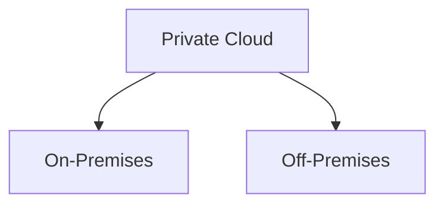

--- 
title: Private Cloud - A Secure, Controlled Cloud Solution for Businesses 
date: 2024-05-25 01:30:00 +/-TTTT0
categories: [DEVOPS, CLOUD_COMPUTING]
tags: [devops, private-cloud, cloud-computing, data-security, regulatory-compliance, on-premises-cloud, off-premises-cloud, data-control, cloud-deployment-models, operational-control, cloud-customization, dedicated-resources, it-infrastructure, cloud-solutions, business-technology]
image:
    path: assets/img/Private-Cloud-Architecture-public.webp
    alt: Private Cloud 
mermaid: true
---

Cloud computing offers various deployment models to meet different business needs, including public, private, hybrid, and community clouds. Among these, the **private cloud** model is particularly popular in organizations that prioritize data security and privacy. A private cloud environment ensures that resources are accessible only within the organization, granting exclusive control over data and infrastructure management.

---

## Understanding Private Cloud

A **private cloud** is a cloud computing model implemented exclusively for a single organization, allowing it to maintain control over its data and infrastructure. Unlike public clouds, where resources are shared across multiple users, private clouds provide an isolated environment for enhanced security. The infrastructure can either be maintained on-premises by the organization itself or hosted off-premises by a third-party provider.

### Key Characteristics

| Characteristic             | Description                                                                                                                             |
|----------------------------|-----------------------------------------------------------------------------------------------------------------------------------------|
| **Data Control**           | Organizations maintain full control over their data, meeting strict data privacy and security regulations.                             |
| **Isolation**              | Unlike public clouds, private clouds are not shared, ensuring exclusive access for the organization.                                   |
| **Customization**          | Infrastructure, security protocols, and software configurations can be customized to meet the organization's specific needs.            |
| **Higher Cost**            | Requires significant initial investment for hardware, software, and maintenance but ensures security and data integrity.                |
| **In-House or Outsourced** | Private clouds can be managed in-house or by a third-party provider, depending on the organization’s resources and preferences.        |

---

## Practical Applications of Private Cloud

Private clouds are beneficial for organizations that require a high degree of control over their data and operations. For instance, the **United States Air Force** leverages a private cloud designed by IBM to store and manage sensitive information across its extensive global network, ensuring secure access and data protection.

---

## Benefits of Private Cloud

| Benefit                      | Description                                                                                                           |
|------------------------------|-----------------------------------------------------------------------------------------------------------------------|
| **Enhanced Data Security**   | Provides maximum control over data, reducing the risk of unauthorized access and data breaches.                      |
| **Compliance**               | Enables organizations to meet specific regulatory standards by maintaining control over data storage and access.     |
| **Operational Control**      | Organizations retain full control over cloud management, allowing them to adjust configurations as needed.          |
| **Customizability**          | Allows organizations to tailor their infrastructure and security settings to their unique requirements.              |
| **Dedicated Resources**      | Resources are dedicated to a single organization, ensuring better performance and reliability.                       |

---

## Private Cloud Deployment: On-Premises vs. Off-Premises

In a private cloud, organizations have the flexibility to deploy their infrastructure either on-premises or off-premises.

1. **On-Premises**: Managed directly within the organization’s data center, providing the highest level of control but requiring substantial investment in IT infrastructure.
2. **Off-Premises**: Hosted by an external provider but dedicated exclusively to the organization. It offers some cost savings and flexibility while maintaining a high level of control.

---

## Choosing the Right Deployment Model

When selecting a deployment model, businesses should assess costs, security requirements, and operational control. For organizations handling sensitive data that must comply with stringent security standards, a private cloud provides unmatched data security and operational control. However, for companies without such requirements, investing in a private cloud may not be the most economical option.

---
The private cloud model is ideal for organizations with significant IT investments and stringent data privacy needs. While it involves higher initial costs, it allows businesses to maintain control over their data, infrastructure, and security. As businesses continue to prioritize data security and regulatory compliance, private clouds provide a robust solution, offering exclusive, tailored cloud environments.
