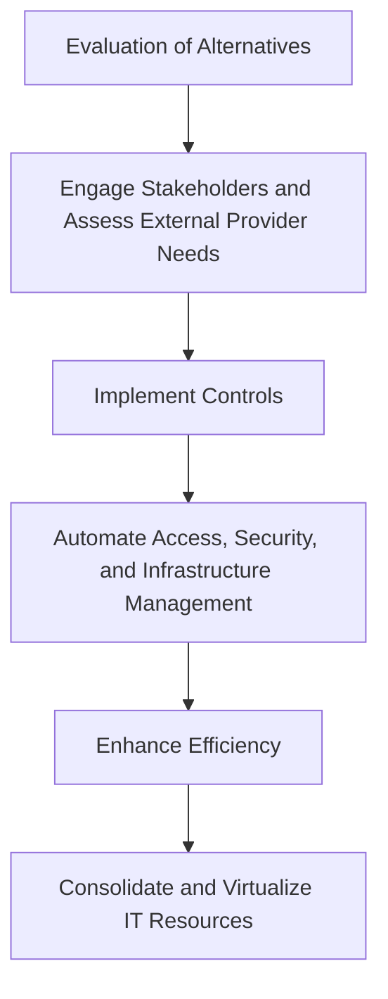

--- 
title: Transitioning to a Private Cloud - Key Steps and Considerations 
date: 2024-05-25 01:50:00 +/-TTTT0
categories: [DEVOPS, CLOUD_COMPUTING]
tags: [devops, private-cloud, cloud-transition, cloud-computing, cloud-readiness, it-management, virtualization, stakeholder-engagement, cloud-security, cloud-governance, automation, resource-management, digital-transformation, cloud-infrastructure, business-objectives, compliance]
image:
    path: assets/img/Private_Cloud_03cc96ec54.png
    alt: Private Cloud 
mermaid: true
---

Transitioning to a private cloud can be transformative for organizations, centralizing data, enhancing security, and enabling scalability. However, the journey to a private cloud involves strategic planning and resource management. This post covers the critical questions organizations should address, the challenges they might face, and the steps necessary to ensure a smooth and effective transition to a private cloud.

---

## Key Considerations for Transitioning to a Private Cloud

### Foundational Questions

Before committing to a private cloud, organizations should evaluate their current IT environment and ask foundational questions to determine readiness for private cloud adoption:

| **Question**                           | **Purpose**                                                                                                    |
|---------------------------------------|---------------------------------------------------------------------------------------------------------------|
| **What is the current state of the organization?** | Assesses existing infrastructure, resource allocation, and internal silos that may affect cloud integration.   |
| **What are the basic aspects that must be ensured?** | Identifies core requirements, such as security protocols, management capacity, and performance standards.     |
| **What will need to be incorporated?**| Outlines key resources, stakeholders, and business goals that must align with cloud capabilities.               |
| **Will external support be necessary?** | Determines if third-party expertise or service outsourcing is required to meet cloud deployment objectives.    |

---

## Organizational Scenarios for Private Cloud Transition

| **Scenario**                   | **Description**                                                                                                                                      | **Transition Strategy**                                                                                                                                                   |
|--------------------------------|------------------------------------------------------------------------------------------------------------------------------------------------------|---------------------------------------------------------------------------------------------------------------------------------------------------------------------------|
| **Company with Silos**         | Departments operate independently with limited integration, often lacking resource sharing or consolidation.                                        | Initiate virtualization and consolidation processes with support from a leader who can promote the benefits of a private cloud to gain organizational buy-in.             |
| **Partial Virtualization**     | Some IT resources are virtualized, but adoption has slowed due to resource or security concerns.                                                     | Develop a structured plan to continue virtualization, address security concerns, and streamline the process for continual cloud integration.                              |
| **Optimized Virtualization**   | More than 50% of resources are virtualized, but there is limited automation or consolidation in IT management.                                      | Focus on process simplification, automate repetitive tasks, and implement unified IT management to maximize virtualization benefits and align with cloud objectives.      |

---

## Core Transition Requirements

| **Requirement**                    | **Description**                                                                                                                                                              |
|------------------------------------|-----------------------------------------------------------------------------------------------------------------------------------------------------------------------------|
| **Business Objectives**            | Define cost savings, operational goals, and technological improvements the cloud must support.                                                                              |
| **Management and Control**         | Establish cloud governance, set performance metrics, and evaluate control mechanisms for cloud oversight.                                                                  |
| **Security and Compliance**        | Ensure secure data handling, compliance with regulations, and contingency measures for business continuity.                                                                |
| **Automation and Resource Access** | Develop a strategy for automating access, security management, and seamless configuration of IT resources across the organization.                                         |
| **Stakeholder Engagement**         | Identify key stakeholders, including executives, IT teams, and external partners, ensuring their roles align with the transition goals.                                    |

---

## Practical Steps for a Successful Transition

| **Step**                              | **Action**                                                                                                                                                                                    |
|---------------------------------------|-----------------------------------------------------------------------------------------------------------------------------------------------------------------------------------------------|
| **1. Evaluate Cloud Readiness**       | Assess the current state of the organization and identify existing resources that are ready for cloud migration.                                                                              |
| **2. Define Transition Goals**        | Establish performance metrics, cost baselines, and compliance requirements to guide the transition.                                                                                           |
| **3. Engage Stakeholders**            | Involve all relevant stakeholders in the transition process, providing them with training and keeping them informed of progress.                                                              |
| **4. Seek External Expertise**        | Determine if third-party support is required for aspects like performance tuning, configuration, and compliance.                                                                              |
| **5. Implement and Monitor**          | Deploy the private cloud infrastructure, ensuring regular monitoring of performance, security, and resource utilization to meet objectives.                                                   |
| **6. Optimize and Scale**             | After implementation, continuously improve cloud processes, automate repetitive tasks, and scale resources as needed.                                                                         |

### Visualizing the Transition Process

---
A successful transition to a private cloud requires strategic planning, stakeholder engagement, and continuous process optimization. By carefully assessing organizational readiness, defining transition goals, and implementing a structured approach, businesses can achieve a secure and efficient private cloud environment that supports scalability and improved IT management. For many organizations, the journey to a private cloud unlocks new levels of operational efficiency, control, and compliance, creating a strong foundation for digital transformation.
