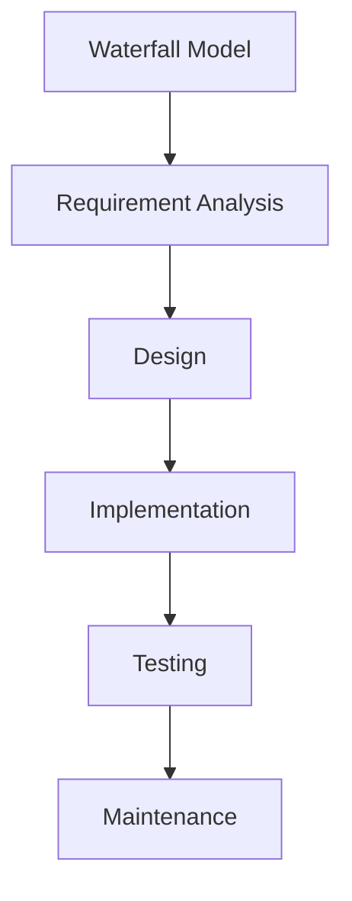
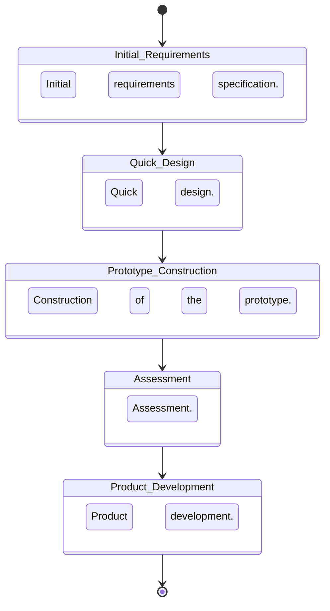

In software development, methodologies can generally be categorized into two groups: **agile** and **traditional (or heavy)**. Traditional methodologies emphasize meticulous planning, comprehensive documentation, and adherence to a strict project plan established in the initial phase. In contrast, agile methodologies focus on adaptability, collaboration, and incremental delivery, allowing teams to respond swiftly to change and align closely with customer needs.

This article delves into the distinctions between agile and traditional methodologies, exploring their respective strengths and weaknesses. As a Project Manager with expertise in DevOps and agile methodologies, it’s essential to understand these differences to choose the approach that best suits each project’s unique requirements.

## Key Advantages of Agile Methodologies over Traditional Approaches

Agile methodologies have become increasingly popular due to their ability to adapt to changing environments and deliver results efficiently. Key advantages of agile approaches include:

1. **Speed**: Agile emphasizes rapid delivery of a Minimum Viable Product (MVP), enabling teams to bring products to market quickly and gather user feedback early.
2. **Economic Efficiency**: Agile reduces development timelines, which can lower costs compared to traditional approaches that often involve lengthy planning phases.
3. **Team Involvement**: Agile projects distribute responsibility across the entire team, fostering a holistic understanding of the project and promoting a culture of shared ownership.
4. **Customer Alignment**: Agile methodologies prioritize continuous customer feedback, allowing teams to adapt the product to real-time needs rather than initial assumptions.
5. **Flexibility**: Agile integrates planning and development phases, facilitating a smooth adaptation to changes without disrupting the project.
6. **Simplicity**: Agile eliminates excessive administrative layers, bringing development teams closer to end users and promoting direct, efficient communication.

Agile methodologies provide a robust framework for delivering quality software under conditions of uncertainty, but they are not without limitations. Understanding when and how to apply agile principles is crucial for maximizing their benefits.

## Key Differences between Agile and Traditional Methodologies

While both agile and traditional methodologies aim to deliver quality software, they differ significantly in approach and application. Major differences include:

- **Team Size and Structure**: Agile is ideal for small teams (fewer than ten members) in a co-located setting, whereas traditional methodologies can support larger, distributed teams.
- **Control and Direction**: Agile is typically self-imposed, with teams determining their workflow. In contrast, traditional methodologies are externally imposed, with strict oversight from management.
- **Adaptability to Change**: Agile thrives in environments where requirements evolve over time. Traditional methodologies, however, often resist change, adhering to a rigid plan.
- **Contract Flexibility**: Agile projects may operate without traditional contracts, instead relying on flexible agreements that accommodate change. Traditional methodologies usually follow predetermined contracts with defined scope and timelines.
- **Role Specialization**: Agile teams have few roles, with members often handling multiple responsibilities. Traditional methodologies include a greater number of specialized roles, each with clearly defined duties.
- **Artifact Production**: Agile emphasizes minimal documentation, focusing on working software. Traditional methodologies prioritize detailed documentation and comprehensive artifacts.
- **Software Architecture**: Traditional methodologies place significant emphasis on software architecture, developing detailed models. Agile prioritizes functional code, often de-emphasizing architectural models.
- **Client Interaction**: Agile integrates clients as part of the development team, enabling direct and continuous collaboration. In traditional methodologies, client interactions are limited to periodic meetings.
- **Process Control**: Traditional methodologies are heavily controlled, with numerous rules and procedures. Agile methodologies, in contrast, follow heuristic practices focused on delivering functional code.

Understanding these differences helps determine which methodology is more suitable for a specific project, based on factors such as project scope, team size, and customer involvement.

## Traditional Software Development Methods

### 1. Waterfall Model

The **Waterfall Model** is a linear and sequential approach where each phase of development must be completed before the next begins. The stages typically include:

- **Requirements Analysis**: Gathering and specifying requirements.
- **Design**: Developing the architecture and design.
- **Implementation**: Coding based on design specifications.
- **Testing**: Validating the product against requirements.
- **Maintenance**: Addressing issues and ensuring long-term functionality.

While straightforward, the Waterfall Model’s rigidity makes it less suitable for projects with evolving requirements, as it lacks flexibility and does not easily accommodate changes once development has begun.

### 2. Incremental Model

The **Incremental Model** combines elements of both the Waterfall and Prototyping models. It involves delivering the product in increments, with each iteration adding functionality. This model begins with a minimal product and progressively incorporates features, producing a series of working builds.

- **Advantages**: Allows for early product testing and user feedback.
- **Limitations**: Requires experience to define increments and manage dependencies effectively.

### 3. Prototype Model

The **Prototype Model** focuses on building a working prototype to explore requirements and gather feedback before developing the final product. This approach is ideal for projects where requirements are not fully understood at the outset.

- **Phases**: Initial requirements, rapid design, prototype development, user evaluation, and refinement.
- **Benefits**: Reduces risk by clarifying requirements and ensuring user satisfaction.
- **Drawbacks**: Can lead to scope creep as users request additional features beyond the initial scope.

### 4. V-Model (Verification and Validation)

The **V-Model** represents development stages in a V-shaped sequence, emphasizing parallel verification and validation. Each development phase corresponds to a testing phase, ensuring that requirements are validated at every step.

- **Left Side of the V**: Involves planning, requirements, and design.
- **Right Side of the V**: Focuses on integration, verification, and validation.
- **Advantages**: Ensures early error detection and systematic validation.
- **Challenges**: Less adaptable to changing requirements, as each stage is dependent on the previous one.

The V-Model is well-suited for projects where requirements are stable and well-defined, allowing for thorough testing at each phase of development.

{: width="700" height="300" }

---

Agile and traditional methodologies each bring unique strengths to software development. Agile’s flexibility, customer focus, and rapid delivery make it well-suited to dynamic environments with evolving requirements. Conversely, traditional methodologies, with their structured processes and emphasis on planning, are better suited to projects with stable requirements and clear deliverables.

For Project Managers and DevOps professionals, selecting the right methodology depends on factors such as project complexity, team size, and customer expectations. By understanding the differences and applications of agile and traditional methodologies, teams can make informed decisions that align with project goals and deliver high-quality software effectively.