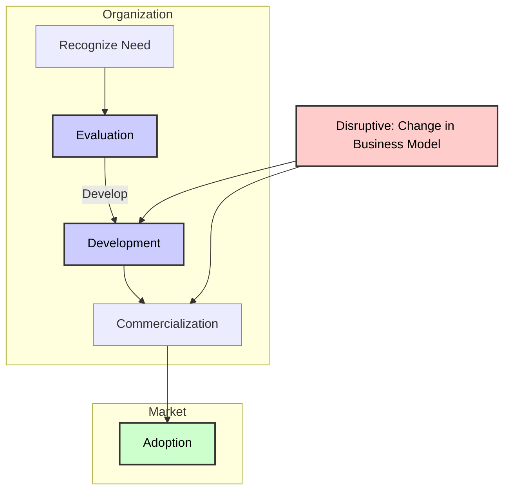

In today’s ever-changing business landscape, organizations, entrepreneurs, and executives must adopt disruptive thinking to stand out. Disruptive thinking challenges the status quo, allowing businesses to surpass customer expectations and deliver unconventional, innovative solutions. This blog post will explore the concept of disruptive thinking and the process of idea development, emphasizing the significance of creativity in driving business growth and competitive advantage.

## Understanding Disruptive Thinking

Disruptive thinking involves breaking away from traditional ideas and adopting fresh perspectives that surprise and captivate. According to Luke Williams, author of *Disrupt: Think the Unthinkable to Spark Transformation in Your Business*, disruptive thinking is about challenging the clichés and conventions that dominate industry practices.

- **Challenging Clichés**: Businesses often operate under established clichés—similar products, prices, and strategies. The power of disruptive thinking lies in identifying these clichés and challenging them. For instance, Williams cites how people usually select from a menu in a restaurant. A disruptive approach might involve creating an entirely new way for customers to interact with a menu, thereby enhancing their experience.

- **Embracing the Unexpected**: Disruptive thinking often starts by identifying opportunities where others may not expect them. For example, looking at areas in your business that are not broken and attempting to innovate can yield powerful results. As the old adage goes, "If it ain't broke, don't fix it" is often the enemy of progress.

*[Luke Williams on Disruptive Thinking](https://www.amazon.com/Disrupt-Think-Unthinkable-Transformation-Business/dp/0137025149)*

## Ingredients for Successful Disruptive Innovation

The basis of disruptive innovation lies in creativity—the ability to think differently and generate new ideas that address unmet needs. This process often involves developing revolutionary objectives while taking evolutionary steps to implement them.

- **Ideas as Recipes**: Paul Romer, an influential economist, likened ideas to recipes that reorganize resources to create new value. For businesses, the goal is to generate a continuous flow of "recipes" that shake up existing markets or create entirely new ones.

- **Identifying the Surplus Society**: Williams also describes the concept of the "surplus society," where businesses fall into a cycle of sameness. Disruptive innovation requires stepping out of these conventions and rethinking what is possible. An example of this is Jonah Staw’s concept of selling mismatched socks as a business idea—a simple yet highly effective disruption that turned a mundane problem into a successful product.

*[Paul Romer on Ideas as Recipes](https://www.forbes.com/sites/briandomitrovic/2018/10/08/paul-romers-economic-growth-recipes-are-delicious-and-nutritious/)*

## Developing Disruptive Ideas

For an idea to have an impact, it must be developed correctly. Effective idea development involves not just creativity, but also careful observation of societal needs and the application of innovative solutions to address those needs.

- **Creative Techniques for Idea Generation**: Tools like brainstorming, mind mapping, and the Delphi technique are useful for generating ideas. A well-developed idea is more likely to succeed when organizational culture and processes support innovation. The environment should be conducive to sharing, building, and refining ideas.

- **From Ideation to Implementation**: Once a creative idea is generated, it must be translated into actionable steps. This process involves presenting the idea, making a detailed business plan, and attracting stakeholders. Disruptive ideas often need a supportive organizational structure to flourish—one that allows freedom, tolerates failure, and encourages experimentation.

*[Techniques for Creativity](https://www.telefonica.com/en/communication-room/blog/methods-techniques-boost-creativity/)*

## Creativity and Innovation in Organizations

Creativity and innovation are critical for staying ahead in the competitive business world. Creativity enables the generation of new ideas, while innovation involves applying those ideas to create new products, services, or processes.

- **Stages of the Innovation Process**: The innovation process involves several key stages, including identifying a need, developing solutions, and commercializing the result. The final stage is adoption by the market, which turns an innovative idea into a successful product or service.

- **Promoting Creativity**: Organizations should create environments that foster creativity. This includes offering flexible workspaces, encouraging open dialogue, and rewarding innovative ideas. By allowing employees to express themselves freely, organizations can drive greater creativity and innovation.

*[Stages of Innovation](https://www.lead-innovation.com/en/insights/english-blog/innovation-process)*

---
Disruptive thinking and idea development are crucial for businesses that want to stay ahead of the competition and adapt to a rapidly changing market. By encouraging creativity, challenging established norms, and embracing new approaches, organizations can create disruptive innovations that redefine their industry. Start thinking disruptively today, and explore the resources linked throughout this post to deepen your understanding of how to apply these concepts effectively.

---

As you explore the power of disruptive thinking:

- Challenge conventions in your industry and identify opportunities for innovation.
- Develop a culture that supports creativity, freedom of thought, and experimentation.
- Stay curious, and remember that disruptive innovation is not just a strategy—it's a mindset.