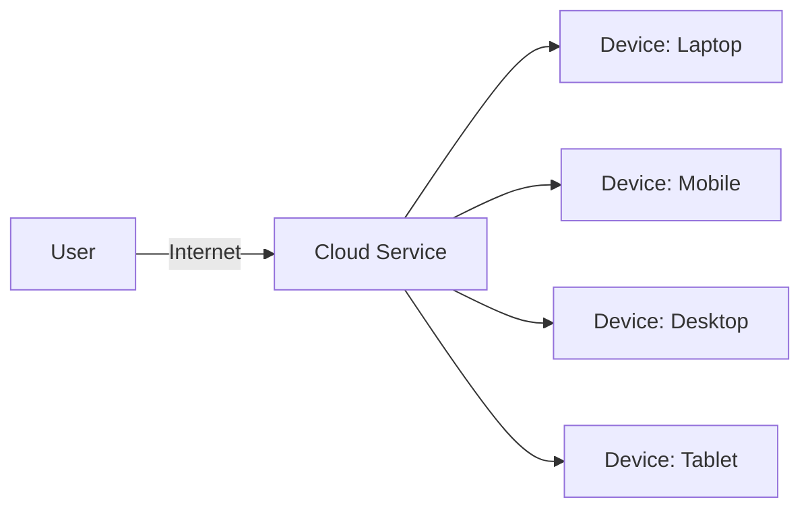

Cloud computing has become a foundational technology for businesses worldwide, offering flexibility, scalability, and cost-effectiveness by providing on-demand access to shared resources. According to the National Institute of Standards and Technology (NIST), cloud computing consists of several defining characteristics, including self-service, scalability, and supervised services. This guide breaks down each characteristic and explores the architectural elements that power the cloud, enriched with diagrams and technical insights.

## Mathematics

We use [**MathJax**][mathjax] to generate mathematics. To enable MathJax for website performance, include the following in your header:

```yaml
---
math: true
---
```

After enabling this feature, you can add equations as demonstrated below.

[mathjax]: https://www.mathjax.org/

## Key Characteristics of Cloud Computing

### 1. Self-Service on Demand

Cloud computing allows users to access services as needed, without requiring human interaction with providers. Users can provision resources, such as virtual machines and storage, through a web-based interface or API. This capability enhances efficiency and reduces dependency on IT support.

**Mathematical Insight**: Resource allocation can be represented as a function of demand over time:

$$
R(t) = D(t) \cdot \alpha
$$

where $$ R(t) $$ is the resource availability at time $$ t $$, $$ D(t) $$ is the demand function, and $$ \alpha $$ is an adjustable scaling factor based on resource limits.

### 2. Ubiquitous Internet Access

One of the primary advantages of cloud computing is its **multi-platform, ubiquitous access**. This characteristic allows users to access data and applications from any device with an internet connection, making cloud services highly accessible and flexible.

#### Diagram: Cloud Computing Accessibility Model
Here’s a diagram illustrating how cloud access functions across different devices.



### 3. Data and Process Relocation

In traditional computing, data storage locations are known, and administrators have direct control over resource locations. Cloud computing, however, abstracts this layer, relocating data and processes across a pool of resources. This approach optimizes load distribution and cost savings but requires users to relinquish location control to cloud providers.

**Technical Note**: This model is achieved through virtualization, where virtual instances can be shifted dynamically. For example, a load balancer can distribute workloads across data centers to improve performance:

$$
\begin{equation}
\text{Load} = \frac{\sum_{i=1}^{n} R_i}{n}
\label{eq:load_distribution}
\end{equation}
$$

where $$ R_i $$ represents resource usage for each instance, and $$ n $$ is the number of instances. This can be referenced as \eqref{eq:load_distribution}.

### 4. Scalability and Flexibility

One of the most celebrated features of cloud computing is **scalability**, allowing users to adjust resources based on demand. This ability is particularly useful for organizations that experience fluctuating workloads, such as e-commerce sites during holiday seasons.

#### Dynamic Scalability Formula:

$$
\begin{equation}
S = R \times \left(\frac{dC}{dt}\right)
\label{eq:scalability}
\end{equation}
$$

where $$ S $$ represents scalability, $$ R $$ is the resource pool, and $$ \frac{dC}{dt} $$ is the change in computational demand over time. Referenced as \eqref{eq:scalability}.

### 5. Supervised Service with Monitoring and Transparency

Cloud providers monitor resource usage automatically, optimizing and reporting utilization to ensure transparency. This helps in cost management and enhances trust between users and providers.

## Key Consideration: Dependence on Third Parties

A unique characteristic of cloud computing is its reliance on third-party providers. Cloud providers manage and maintain hardware, provide security, and offer specialized facilities for resource management. Although outsourcing these responsibilities can enhance reliability and reduce costs, it also introduces dependency on the provider’s infrastructure and services.

---
Cloud computing is a transformative technology, offering businesses a scalable, efficient, and cost-effective way to manage resources. Understanding its core characteristics—self-service, internet access, data relocation, scalability, and supervised service—helps organizations maximize the benefits of the cloud. With advanced features like virtualization and dynamic scaling, cloud computing is set to remain a cornerstone of modern IT strategies.