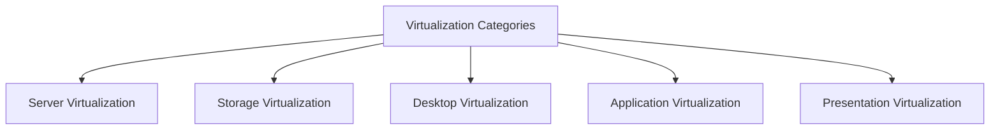

Virtualization is fundamental to modern IT environments, enabling efficient resource management by abstracting physical hardware into virtual resources. This process allows organizations to allocate resources, optimize hardware usage, and improve flexibility. Virtualization spans multiple categories, each tailored to different aspects of IT needs—from storage to applications. This post examines key virtualization categories, discussing their benefits and applications in business.

---

## Virtualization Categories Overview

Virtualization involves creating a logical separation between services and the physical hardware that provides them. Depending on the resources virtualized, we can classify virtualization into several categories:

### 1. Server Virtualization

**Server virtualization** partitions a single physical server into multiple virtual servers, allowing each to function independently. This approach isolates domains within the same hardware, ensuring that each virtual server operates securely without interference.

#### Benefits of Server Virtualization

- **Fault Isolation**: Ensures stability by isolating server domains, enhancing system reliability.
- **Hardware Independence**: Enables the use of legacy applications in modern environments.
- **Cost Savings**: Reduces energy and maintenance costs associated with physical servers.
- **Efficient Resource Usage**: Balances workloads across virtual machines, optimizing hardware utilization.

### 2. Storage Virtualization

**Storage virtualization** consolidates multiple storage devices into a unified, virtualized storage pool. This category allows businesses to manage storage efficiently, distributing data based on its importance and performance needs.

#### Key Features of Storage Virtualization

- **Creation of Virtual Storage Networks**: Simplifies storage management by creating logical storage units.
- **Energy Efficiency**: Optimizes energy consumption by effectively distributing data storage.
- **Storage Optimization**: Allocates critical data to high-performance disks and less critical data to standard disks.

### 3. Desktop Virtualization

**Desktop virtualization** enables remote access to a desktop environment, allowing applications and data to run on a central server instead of individual devices. This category is particularly beneficial for remote work, providing secure access to work environments across devices.

#### Advantages of Desktop Virtualization

- **Remote Accessibility**: Users can access their desktops from various devices, increasing flexibility.
- **Centralized Management**: IT teams can manage and secure desktops from a central location.
- **Enhanced Security**: Since data and applications are stored on the server, device loss doesn’t compromise data.

### 4. Application Virtualization

In **application virtualization**, applications run on virtual machines instead of directly on local devices. This approach allows applications to be used across different operating systems without compatibility issues.

#### Application Virtualization Benefits

- **Cross-Platform Compatibility**: Applications can run on any OS, regardless of initial design.
- **Resource Efficiency**: Virtualization isolates applications, preventing conflicts with the local system.
- **Improved Security**: Isolated applications reduce the risk of system-wide malware infections.

### 5. Presentation Virtualization

**Presentation virtualization** allows applications to run on a server while the interface is accessed and controlled from the client device. This is useful for delivering specific applications without fully virtualizing the desktop.

#### Key Uses of Presentation Virtualization

- **Interface Isolation**: Separates graphical and I/O processing, allowing users to interact seamlessly with server-hosted applications.
- **Flexible Access**: Users can interact with applications remotely, using the same interface as they would locally.

### 6. Network Virtualization

**Network virtualization** abstracts physical network resources, enabling multiple virtual networks to coexist on a shared physical network infrastructure. By creating isolated virtual networks, network virtualization enhances security, optimizes network performance, and simplifies management. Each virtual network can operate independently, with dedicated bandwidth, routing policies, and firewall settings, making it ideal for data centers and cloud environments.

#### Benefits of Network Virtualization

- **Improved Security**: Isolated virtual networks prevent unauthorized access and reduce the risk of data breaches.
- **Enhanced Resource Utilization**: Optimizes bandwidth and minimizes idle network resources by dynamically allocating network capacity based on demand.
- **Scalability and Flexibility**: Simplifies network expansion, allowing rapid provisioning of new virtual networks.
- **Simplified Management**: Centralized network control makes it easier to manage, monitor, and troubleshoot network resources across virtualized environments.

---
Virtualization transforms the way organizations manage IT infrastructure, from server and storage efficiency to cross-platform application deployment. By categorizing virtualization based on specific needs, businesses can deploy solutions that enhance productivity, streamline management, and improve cost-efficiency. Virtualization continues to evolve, providing a robust framework for flexible and scalable IT environments.