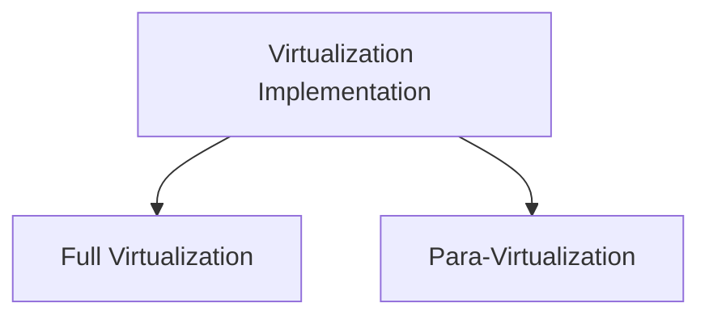

Virtualization is a core component of modern IT infrastructure, providing a way to simulate physical computer resources, from entire servers to individual applications. This technology enables organizations to maximize resource utilization, improve efficiency, and reduce hardware costs by creating multiple virtual instances on a single physical machine. This post dives into the basics of virtualization, its advantages, and the key methods for implementing it.

## What is Virtualization?

At its core, **virtualization** involves creating an abstraction layer between hardware and software, allowing virtual versions of systems, storage, and networks to operate independently on shared physical resources. This approach enables multiple virtual machines (VMs) to run various applications and operating systems on the same physical server, each with its isolated environment.

### Key Advantages of Virtualization

Virtualization offers significant benefits, including:
- **Resource Optimization**: VMs allow for the efficient use of hardware by maximizing CPU, memory, and storage usage.
- **Cost Savings**: Reduces the need for multiple physical machines, thereby saving space, power, and maintenance costs.
- **Enhanced Testing and Development**: VMs make it easy to create test environments without impacting production, thanks to quick cloning and isolation.
- **Isolation**: Virtual machines are sandboxed; if one VM crashes, it doesn’t affect others on the same host.
- **Disaster Recovery**: Simplified recovery by moving VMs to backup hardware in case of a physical server failure.

---

## Types of Virtualization Implementation

Virtualization can be implemented in several ways, with **full virtualization** and **para-virtualization** being the two primary methods.

### 1. Full Virtualization

**Full virtualization** fully emulates the underlying hardware, creating a completely isolated environment for each VM. This method doesn’t require modifications to the guest operating systems, allowing them to function as if they were running on dedicated hardware.

#### Advantages of Full Virtualization

- **Isolation**: Each VM operates independently, preventing unstable VMs from impacting others.
- **Hardware Flexibility**: Emulates consistent hardware, allowing VMs to operate seamlessly on different physical setups.
  
However, full virtualization comes with a performance cost due to the overhead of fully emulating the hardware layer.

### 2. Para-Virtualization

In **para-virtualization**, VMs are aware of the virtualized environment, requiring modifications to the guest operating systems. Unlike full virtualization, para-virtualized VMs interact with the host hardware more directly, achieving higher efficienc.

#### Para-Virtualization Benefits

- **Reduced Overhead**: Since para-virtualized VMs know they’re virtualized, they interact with the hardware more efficiently, reducing emulation costs.
- **Efficient Resource Management**: Para-virtualization improves performance in scenarios like disaster recovery, migration, and capacity management.

Para-virtualization is especially useful in disaster recovery and system migration tasks, where minimizing downtime and facilitating quick shifts between environments is critical.

---

## Practical Applications of Virtualization

Virtualization has numerous applications, from enabling agile development and testing environments to providing resilience in disaster recovery. Below are some common scenarios where virtualization shines:

1. **Data Center Optimization**: Virtualization reduces the number of physical servers, consolidating resources into fewer machines to save space and power.
2. **Test Environments**: Developers and testers can create sandbox environments to test software without risking production stability.
3. **Disaster Recovery**: Virtualization simplifies disaster recovery by allowing VMs to be migrated or restored on different hardware if needed.

## Virtualization Formula for Resource Allocation

An effective virtualization environment aims to balance CPU, memory, and storage usage across VMs. The **resource allocation** in a virtualized environment can be modeled as:

$$
R = \frac{T \times H}{V}
$$

where:
- \( R \) is the resource efficiency ratio,
- \( T \) represents the total available resources,
- \( H \) is the hardware utilization factor,
- \( V \) is the number of virtual machines on the host.

A higher \( R \) value indicates more efficient resource allocation.

---
Virtualization is a transformative technology that optimizes hardware utilization, reduces costs, and simplifies IT management. By abstracting hardware from software, organizations gain flexibility, scalability, and improved resource management. Whether through full virtualization or para-virtualization, the possibilities are vast, providing agility and resilience across IT environments. 

As the cornerstone of cloud computing, virtualization is integral to modern infrastructure, empowering businesses to stay agile and scalable in an ever-evolving digital landscape.
