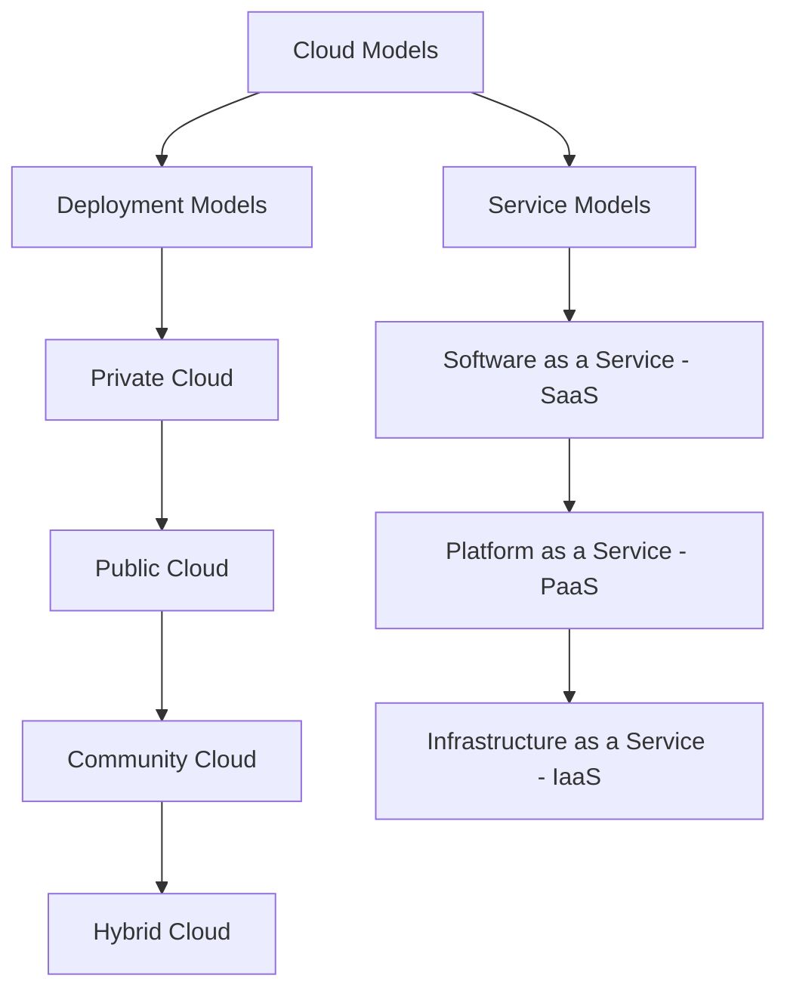

Cloud computing has redefined how businesses and individuals access and manage IT resources. From storage to computing power, cloud models enable on-demand services, optimized costs, and scalability. Cloud models are categorized into **deployment models** (based on location and management) and **service models** (based on the type of resources provided). This post unpacks these cloud models, detailing each type’s characteristics and ideal applications, complete with diagrams and technical insights.

---

## Cloud Models Overview

Cloud computing is divided into two primary types of models:

### Deployment Models

Deployment models define the location and management structure of cloud resources. They encompass **private**, **public**, **community**, and **hybrid clouds**.

1. **Private Cloud**: This model is exclusive to a single organization, providing enhanced security and control over data and applications. Managed privately, it’s ideal for companies with strict data compliance needs.

   

2. **Public Cloud**: A public cloud offers services to multiple users over the internet. Managed by external providers, it is suitable for businesses that prioritize scalability and cost-efficiency.

   

3. **Community Cloud**: Designed for a group with shared interests, such as government agencies, community clouds support collaboration while maintaining compliance.

   

4. **Hybrid Cloud**: A hybrid cloud integrates two or more cloud types, enabling data and application portability. This model supports flexibility, allowing data-sensitive operations to remain on private clouds while scaling workloads on public clouds as needed.

   

#### Hybrid Cloud Flexibility Formula:

To represent the benefits of hybrid cloud flexibility, consider a weighted resource allocation function:

$$
R = \sum_{i=1}^{n} w_i \cdot C_i
$$

where:
- \( R \) is the total resource availability,
- \( w_i \) is the weight assigned to each cloud (private, public, etc.),
- \( C_i \) represents the capacity of each cloud in the hybrid setup.

---

### Service Models

Cloud service models categorize the types of resources provided by cloud computing platforms. These are **Software as a Service (SaaS)**, **Platform as a Service (PaaS)**, and **Infrastructure as a Service (IaaS)**.

1. **Software as a Service (SaaS)**: In this model, applications are hosted on cloud infrastructure and accessed via the internet. Users have limited control over the application’s backend, making it ideal for software that requires minimal customization, such as CRM or office tools.

   

2. **Platform as a Service (PaaS)**: PaaS provides a platform for developers to build and deploy applications without managing underlying infrastructure. It’s particularly useful for development environments, as it offers pre-configured frameworks and programming tools.

   

3. **Infrastructure as a Service (IaaS)**: IaaS provides fundamental computing resources like virtual machines, storage, and networks. Users control the OS and deployed applications, which allows for greater customization and is suitable for businesses with complex applications.

   

#### Service Model Cost Function:

The cost efficiency of cloud models can be estimated by a usage-based cost function:

$$
C = U \cdot R \cdot T
$$

where:
- \( C \) is the total cost,
- \( U \) is the utilization rate of resources,
- \( R \) represents the rate per resource unit,
- \( T \) is the time duration of usage.

This equation demonstrates how SaaS typically has fixed costs, whereas IaaS and PaaS costs vary with usage, providing a flexible pricing model for users with varying demands.

---
Understanding cloud models helps businesses select the right setup based on control, flexibility, and resource needs. Deployment models determine where and how resources are managed, while service models define what type of resources are provided. By leveraging these models effectively, organizations can scale operations, improve cost efficiency, and maintain security compliance.
