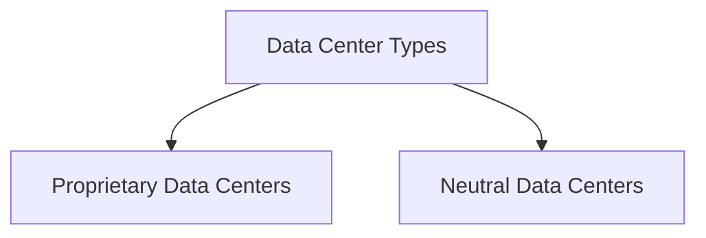

--- 
title: Understanding Remote Data Center Services - Key to Scalable and Reliable IT Infrastructure
date: 2024-10-22 01:10:00 +/-TTTT0
categories: [DEVOPS, CLOUD_COMPUTING]
tags: [devops, remote-data-center, cloud-computing, infrastructure-as-a-service, platform-as-a-service, software-as-a-service, proprietary-data-center, neutral-data-center, meet-me-room, network-access, data-center-infrastructure, vendor-lock-in, scalability, cost-efficiency, data-security, it-infrastructure]
image:
    path: assets/img/Typical_CASO-Configured_BE_environment.png
    alt: Remote Data Center Services 
mermaid: true
---

Remote data center services have become a foundational element in cloud computing, enabling businesses to outsource infrastructure management and leverage high-performance computing without needing physical servers on-premises. By transferring infrastructure responsibilities to cloud providers, companies benefit from increased flexibility, cost savings, and improved scalability. This post delves into the types of data centers, their significance in cloud services, and factors to consider when choosing a data center model.

## What are Remote Data Center Services?

In a **remote data center** setup, the responsibility for maintaining and managing IT infrastructure is handed over to a third-party provider. This model allows businesses to focus on their core operations, while the service provider ensures optimal functionality and uptime of the infrastructure, platform, and software.

### Key Decisions for Cloud Users

When adopting cloud services, users mainly decide on:
1. **Access Device**: The device from which they will connect (e.g., laptop, tablet).
2. **Network Access**: The type of network connection for accessing services.

All other decisions—such as infrastructure, software, and platform maintenance—fall under the provider's responsibilities, ensuring a seamless cloud experience.

---

## Types of Data Centers

Data centers come in two main types: **proprietary** (or operator-owned) and **neutral** data centers. Each type offers distinct advantages and limitations.

### 1. Proprietary Data Centers

**Proprietary data centers** are owned and operated by telecommunications companies or specific service providers. These centers often offer exclusive access to their own network services, creating a dependency on the provider’s telecommunications solutions. Though proprietary centers may provide lower prices for bundled services, they may lack the flexibility required by clients who need a broader range of telecom options.

### 2. Neutral Data Centers

In contrast, **neutral data centers** are independent facilities that offer access to multiple telecommunications providers. This model allows clients to choose their preferred telecom services without being tied to a single provider, providing greater flexibility and reducing the risk of vendor lock-in.

#### The Meet-Me-Room Concept

Neutral data centers often use a **Meet-Me-Room (MMR)**, a physical space where various telecom providers offer services in an open market. Clients benefit by paying only for the physical interconnection, gaining full access to a variety of network services without dependency on any single provider.

---

## Advantages of Remote Data Center Services

Remote data center services offer multiple advantages that make them attractive to businesses looking to streamline their IT operations:

1. **Scalability**: Easily scale resources up or down based on demand, without the need for on-premises hardware.
2. **Cost Efficiency**: Eliminate costs associated with maintaining physical infrastructure, including energy, cooling, and security expenses.
3. **Reliability and Uptime**: Data center providers offer robust infrastructure with redundant power and backup systems, ensuring high availability.
4. **Enhanced Security**: Providers implement strict security protocols, from physical security to data encryption, ensuring data protection.

---
Remote data center services play a crucial role in cloud computing, providing scalable, reliable, and cost-efficient solutions for modern businesses. By choosing the right type of data center—proprietary for bundled cost savings or neutral for flexibility—organizations can optimize their IT infrastructure to support growth and meet specific operational needs. Neutral data centers, with their Meet-Me-Rooms, offer unparalleled flexibility, making them a popular choice for businesses seeking vendor independence.

As cloud computing continues to grow, remote data centers will remain integral to supporting infrastructure as a service (IaaS), platform as a service (PaaS), and software as a service (SaaS) solutions, powering the next generation of digital transformation.
