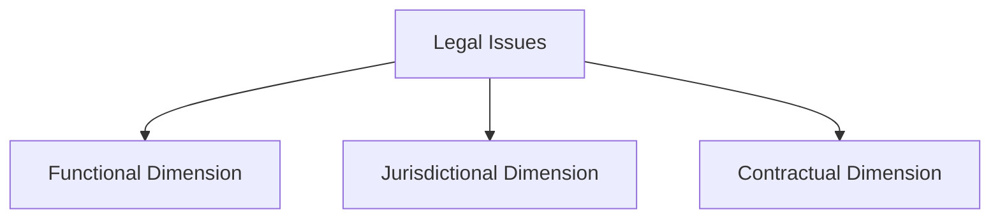

--- 
title: Navigating Basic Legal Issues in Cloud Computing 
date: 2024-10-22 01:40:00 +/-TTTT0
categories: [DEVOPS, CLOUD_COMPUTING]
tags: [devops, cloud-security-governance, information-integrity-audit, risk-management-strategies, cloud-compliance-regulations, security-controls-standards, provider-customer-cooperation, asset-inventory-risk-assessment]
image:
    path: assets/img/CLOUD_Legal_issues.jpg 
    alt: Legal Issues in Cloud Computing
mermaid: true
---

Cloud computing introduces new dynamics and relationships between organizations and the information they manage. This shift often involves third-party cloud providers, which bring novel challenges and legal implications. Understanding these issues requires an analysis of functional, jurisdictional, and contractual dimensions.

---

## Key Legal Dimensions in Cloud Computing

To grasp the legal complexities surrounding cloud computing, we need to consider three main dimensions:

1. **Functional Dimension**: This dimension focuses on the legal implications that cloud services create for both service participants and stakeholders. It requires a thorough understanding of which cloud computing functions may affect legal responsibilities.

2. **Jurisdictional Dimension**: This aspect deals with how different governments enact laws that affect cloud services and the information processed. Since cloud services often operate across borders, understanding international regulations and jurisdictional impacts is crucial.

3. **Contractual Dimension**: Contracts define terms, responsibilities, and security measures. Cloud service agreements must be crafted carefully to address liability, data security, and compliance, ensuring clarity for all parties involved.

---

## Unique Legal Challenges in Cloud Computing

Unlike traditional outsourcing, cloud computing presents unique legal characteristics:

- **A La Carte and Scalable Services**: Cloud services are typically offered on demand, which can complicate the contractual and legal responsibilities of providers and clients.
- **Anonymity of Service Providers**: The identity of specific cloud service providers may be obscure, making accountability harder to enforce.
- **Server Location Anonymity**: Knowing where data is physically stored is crucial for compliance with local laws, yet this information is often unclear in cloud arrangements.

### Client Responsibility in IaaS and PaaS Models

In Infrastructure as a Service (IaaS) and Platform as a Service (PaaS) setups, much of the software design and configuration rests with the client. Consequently, responsibility for data protection and compliance cannot easily be transferred to the cloud provider. This division of responsibility underscores the importance of understanding the legal nuances involved.

---

## Legislative Developments and Global Standards

Courts worldwide are beginning to recognize the need for global legal frameworks to ensure cloud service accountability and security. The United States and European Union have established laws that:

- **Impose Security Responsibilities**: In some cases, cloud subcontractors are held accountable for data security.
- **Mandate Clear Contractual Agreements**: Providers and clients must define liabilities and security measures in service contracts.

---

## Recommendations for Mitigating Legal Risks

Given the evolving nature of cloud legislation, organizations should adopt proactive measures to mitigate risks:

1. **eDiscovery and Data Preservation**: Both clients and providers must understand their roles in electronic discovery, document preservation, and investigations in case of litigation.
2. **Authentic Data Handling**: Providers should implement security systems that meet client requirements and ensure data integrity.
3. **Equal Data Treatment**: Data stored in the cloud must receive the same level of protection as on-premises data.
4. **Contractual Planning**: Contracts should include provisions for dispute resolution, asset disposal, and safe data return.
5. **Duty of Diligence**: From pre-contract negotiations to post-contract monitoring, diligence is required to manage legal risks effectively.
6. **Data Location Awareness**: Knowing where data is stored helps ensure compliance with cross-border data laws.
7. **Data Ownership**: Companies must retain ownership and the ability to authenticate data in its original format.
8. **Clear Security Commitments**: Contracts should specify security responsibilities for both the provider and the client.
9. **Unified Legal Response**: A process must be established for responding to subpoenas and legal inquiries.
10. **Performance Monitoring**: Clients or third parties should have the right to monitor provider performance and assess system vulnerabilities.
11. **Data Recovery Provisions**: Contracts should outline plans for data retrieval once the service agreement ends.

---

## Conclusion

The legal landscape of cloud computing is complex and continually evolving. Organizations must be vigilant in understanding and negotiating their roles and responsibilities when engaging with cloud services. By addressing functional, jurisdictional, and contractual dimensions and implementing robust legal safeguards, businesses can mitigate risks and protect their data in the cloud environment.

---

### Tags

`cloud-security-governance, information-integrity-audit, risk-management-strategies, cloud-compliance-regulations, security-controls-standards, provider-customer-cooperation, asset-inventory-risk-assessment, DevOps`

---