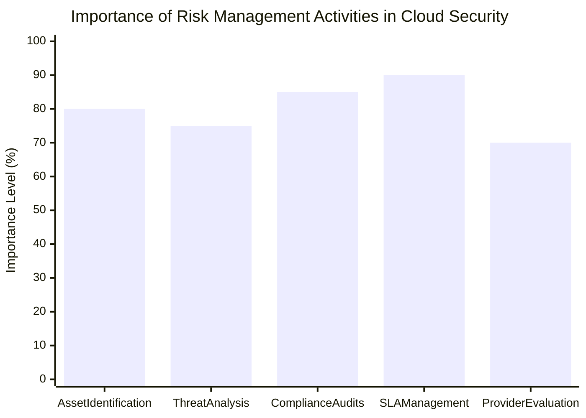

--- 
title: Risk Management in Cloud Business Environments 
date: 2024-10-23 01:30:00 +/-TTTT0
categories: [DEVOPS, CLOUD_COMPUTING]
tags: [devops, loud-risk-management, information-security, SLA-management, compliance, cloud-governance, asset-identification, risk-assessment, cloud-compliance, security-controls, provider-evaluation, devops-strategy, cloud-security, business-risk-management]
image:
    path: assets/img/risk-management.jpg 
    alt: Risk Management 
---

Effective risk management is essential for any business, especially in cloud computing environments. The complexity of cloud services introduces unique challenges, including managing information security and ensuring compliance. This post outlines strategic recommendations for risk management and governance in cloud environments, helping businesses mitigate risks and maintain control over their cloud assets.

---

## Key Aspects of Cloud Risk Management

Managing risks in cloud environments involves establishing robust security policies, maintaining asset inventories, and ensuring that service level agreements (SLAs) reflect security needs. Below are the critical challenges and strategic recommendations for effective risk management in the cloud.

---

## Challenges in Cloud Risk Management

| **Challenge**                                              | **Description**                                                                                                                                                                |
|------------------------------------------------------------|-------------------------------------------------------------------------------------------------------------------------------------------------------------------------------|
| **Information Governance**                                 | A lack of focus on governance can lead to vulnerabilities. Effective processes ensure a scalable security management policy aligned with business objectives.                  |
| **Regulatory Compliance**                                  | Ensuring compliance with industry standards is crucial, particularly in multi-tenant and à la carte cloud services that may not suit traditional audit practices.              |
| **Supply Chain Security**                                  | Cloud service supply chains often involve multiple stakeholders, complicating the enforcement of security guarantees.                                                          |
| **Asset Identification and Threat Analysis**               | Organizations must identify and assess the value of cloud-hosted assets and analyze potential threats and vulnerabilities.                                                     |

---

## Strategic Recommendations for Cloud Risk Management

### Governance and Organizational Strategies

| **Recommendation**                                         | **Details**                                                                                                                                                                   |
|------------------------------------------------------------|-------------------------------------------------------------------------------------------------------------------------------------------------------------------------------|
| **Invest in Provider Monitoring**                          | Use cost savings from cloud services to fund ongoing monitoring of provider security and perform detailed assessments to ensure compliance.                                   |
| **Collaborative Governance**                               | Cloud security governance should involve both the provider and the client, aligning security measures with business goals.                                                    |
| **Evaluate Service Providers**                             | Assess providers' maturity in information security processes, and ensure their controls align with organizational security requirements.                                      |
| **Design Risk Protocols**                                  | Risk management protocols should be included in service contracts, with measurable and auditable standards and metrics.                                                       |
| **Establish Service Level Metrics**                        | Metrics for measuring service security effectiveness should be defined and documented before moving operations to the cloud.                                                  |

---

### Risk Management Best Practices

| **Best Practice**                                          | **Implementation Strategy**                                                                                                                                                   |
|------------------------------------------------------------|-------------------------------------------------------------------------------------------------------------------------------------------------------------------------------|
| **Analyze SLAs Meticulously**                              | Conduct a detailed review of service level contracts to ensure they meet security needs, particularly where physical infrastructure control is lacking.                        |
| **Tailor Audit Processes**                                 | Modify traditional audit and evaluation processes to accommodate cloud-specific risk management needs.                                                                        |
| **Comprehensive Risk Assessments**                         | Perform systematic risk assessments, including asset identification, threat analysis, impact analysis, and probability assessments.                                            |
| **Joint Risk Scenario Planning**                           | Collaborate with the service provider to establish risk scenarios and agree on risk management strategies.                                                                    |
| **Monitor Residual Risks**                                 | Define and understand acceptable risk levels and assess the residual risks associated with cloud services, making sure they align with business objectives.                     |

---

## Visualizing Risk Management Strategies

The chart below illustrates the importance of different risk management activities in ensuring cloud security and compliance.

---
Effective risk management in cloud computing environments requires proactive governance, meticulous SLA review, and strategic collaboration between providers and clients. By establishing clear metrics and conducting regular risk assessments, organizations can safeguard their cloud assets while aligning with business goals. As cloud adoption continues to grow, these practices will be instrumental in mitigating risks and ensuring the security and reliability of cloud services.
