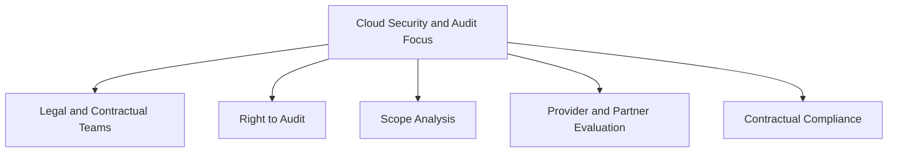

--- 
title: Security and Quality Audits in Cloud Computing - Ensuring Compliance and Trust
date: 2024-10-22 01:40:00 +/-TTTT0
categories: [DEVOPS, CLOUD_COMPUTING]
tags: [devops, cloud-security, regulatory-compliance, auditing-cloud-services, cloud-contracts, data-protection, information-management, security-controls, iso-27001-27002, sas-70-type-ii, cloud-infrastructure, policy-procedures]
image:
    path: assets/img/selection-034-500x500.webp 
    alt: Quality Audits
mermaid: true
---

Cloud computing has revolutionized the way businesses manage and store data. The flexibility and efficiency of cloud models make them appealing for outsourcing everything from simple data storage to complex business processes. However, this shift also introduces substantial challenges, particularly in maintaining compliance with evolving security policies and regulatory standards.

This post delves into the key security and quality audit practices organizations should adopt to ensure proper compliance and robust data protection in cloud environments.

---

## Challenges in Cloud Security and Compliance

Regulatory frameworks were originally designed without considering the characteristics of modern cloud computing. As a result, both **security auditors** and **advisors** may not be fully versed in cloud-specific challenges. This knowledge gap emphasizes the need for organizations to manage cloud service relationships effectively.

### Key Aspects to Consider

1. **Regulatory Applicability**: Organizations must ensure that the specific regulations applicable to their industry are addressed when using cloud services.
2. **Shared Responsibilities**: Clarifying who is accountable for compliance—whether it’s the cloud service provider or the client—is critical for effective governance.
3. **Proof of Compliance**: The ability of providers to present evidence of regulatory compliance is crucial, as clients may need to produce such proof for audits or legal inquiries.

---

## Recommendations for Effective Security Audits

Organizations can adopt several best practices to manage compliance and conduct effective security audits:

| **Recommendation**                             | **Explanation**                                                                                                              |
|-------------------------------------------------|------------------------------------------------------------------------------------------------------------------------------|
| **Involve Legal Teams**                        | Cloud provider contracts may not meet specific compliance requirements, so legal teams should negotiate terms to ensure coverage. |
| **Right to Audit Clause**                      | Ensure the contract allows auditing the cloud provider, especially if the client holds regulatory responsibilities.           |
| **Scope of Compliance**                        | Identify how cloud services impact your regulatory obligations, ensuring no regulations are inadvertently violated.           |
| **Impact of Regulations on Security**          | Analyze which data and applications should be cloud-based to avoid breaching regulations.                                    |
| **Evaluate Providers and Partners**            | Review providers and their partnerships to ensure compliance standards are upheld, even through third-party vendors.         |
| **Contractual Responsibilities**               | Understand local and global data protection laws, ensuring contracts specify compliance obligations clearly.                  |
| **Infrastructure Impact**                      | Some regulations may impose strict controls that are difficult to implement within cloud infrastructure.                     |
| **Policy and Procedure Adjustments**           | Moving data to the cloud may require significant changes to organizational policies and procedures to maintain compliance.    |
| **Evidence and Metrics Preparation**           | Develop processes to gather and store compliance evidence, such as audit logs and activity reports.                          |
| **Selecting Auditors**                         | Choose auditors knowledgeable in IaaS, PaaS, and SaaS to ensure proper understanding of cloud complexities.                   |

---

## Essential Audit Certifications for Cloud Providers

Cloud providers should meet specific certifications to ensure they implement and maintain security controls effectively:

- **SAS 70 Type II**: Ensures that documented security controls are effectively implemented, providing assurance to potential clients.
- **ISO 27001/27002**: Standards for information security management systems. Providers offering critical services should have these certifications or commit to achieving them.

### Example: ISO Standards in Action

If a provider lacks ISO 27001 certification, they should align with ISO 27002 practices and present a plan to achieve certification. This commitment enhances trust and demonstrates proactive measures toward comprehensive data protection.

---

## The Role of Cloud Clients in Security Audits

Clients must understand their responsibilities in ensuring cloud security. This includes monitoring regulatory changes, collaborating with providers for evidence of compliance, and preparing for possible audits. 

### Visualizing Security Audit Focus Areas

---
Security and quality audits in cloud computing require an integrated approach involving legal teams, audit rights, and a comprehensive understanding of the impact of regulations. By following the outlined recommendations and ensuring cloud providers meet critical certifications, organizations can maintain compliance and protect their data effectively.

Cloud computing offers immense opportunities, but with these come the responsibility to manage security and regulatory compliance proactively. Organizations must remain vigilant, adaptable, and collaborative to navigate the complex legal landscape successfully.
