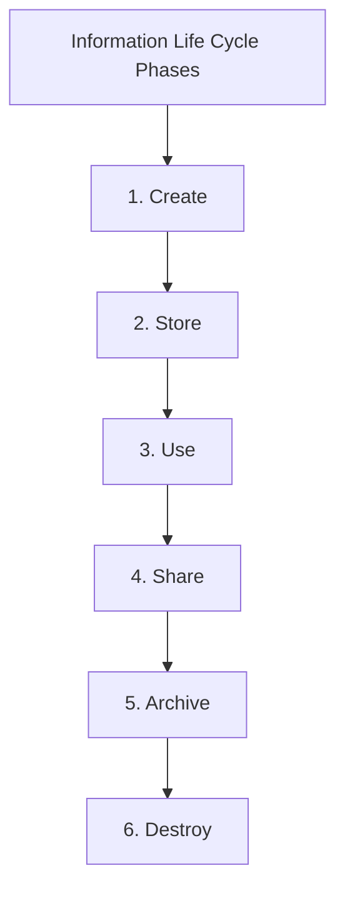

--- 
title: The Information Life Cycle in Cloud Computing - Challenges and Security Best Practices
date: 2024-10-22 02:00:00 +/-TTTT0
categories: [DEVOPS, CLOUD_COMPUTING]
tags: [devops, cloud-security, data-protection, information-life-cycle, security-strategies, data-recovery, e-discovery, content-discovery, encryption-methods, access-controls, asset-management, digital-rights, tagging, file-system-controls, log-files, permissions-control, backup-copies, long-term-storage, key-destruction, physical-destruction]
image:
    path: assets/img/ILM1.png 
    alt: Information Life Cycle in Cloud Computing 
mermaid: true
---

As organizations transition to cloud computing, traditional data management practices must evolve to accommodate new challenges posed by the cloud’s architecture. The main objective of information security in cloud systems is to protect critical data throughout its entire life cycle, from creation to destruction. This life cycle reflects the unique security needs of each phase and outlines best practices to ensure data integrity and compliance.

---

## The Six Phases of the Information Life Cycle

In a cloud environment, data goes through six key phases, each requiring specific security measures to safeguard information.

1. **Create**: Information is generated or collected, and appropriate classification and labeling are critical at this stage.
2. **Store**: Data must be securely stored using encryption and access controls to prevent unauthorized access.
3. **Use**: Data is accessed and modified as needed, requiring monitoring and logging to track usage.
4. **Share**: Data sharing, while optional, must be controlled and permissions-based to ensure only authorized users have access.
5. **Archive**: Infrequently used data is archived securely for future reference, employing backup and encryption methods.
6. **Destroy**: When data is no longer needed, it must be completely destroyed to prevent misuse or unauthorized recovery.

---

## Challenges in Managing the Information Life Cycle

Moving data to the cloud introduces several unique security and compliance challenges that organizations must address:

1. **Data Security**: Ensuring data confidentiality, integrity, availability, and authenticity in the cloud. This includes implementing authorization and authentication protocols.
2. **Geo-Location of Data**: Data must be stored in locations permitted by service contracts and legal regulations, which can be complex when dealing with international laws.
3. **Persistence of Information**: Data must be fully removed from all locations, which is difficult in a cloud environment due to redundant backups and distributed storage.
4. **Data Mixing**: Preventing sensitive data from being intermingled with data from other cloud clients during storage, use, or transit.
5. **Data Recovery and Restoration**: Establishing plans to ensure information can be recovered in case of accidental loss, corruption, or destruction.
6. **Information Discovery**: Adhering to electronic discovery (eDiscovery) requirements and proving data authenticity to legal authorities, which is complicated by the distributed nature of the cloud.

---

## Security Recommendations for Each Phase

To address these challenges, organizations must adopt specific security practices tailored to each phase of the information life cycle.

### Create

- **Data Classification and Labeling**: Identify and label data based on its sensitivity and security requirements.
- **Digital Rights Management**: Implement digital rights controls to manage data usage and permissions.
- **Data Tagging**: Use digital labels for efficient tracking and management.

### Store

- **Access Controls**: Properly configure file system permissions to restrict access to authorized users only.
- **Data Encryption**: Use robust encryption methods for data at rest to ensure confidentiality.
- **Content Discovery Tools**: Employ tools to audit and monitor data stored in the cloud.

### Use and Share

- **Activity Tracking**: Maintain logs of all actions performed on data to detect and prevent unauthorized alterations.
- **Permissions Management**: Set clear permissions to control who can view or modify data.

### Archive

- **Backup Encryption**: Encrypt data stored in backups or long-term archives to prevent unauthorized access.
- **Asset Monitoring**: Implement asset management practices to track archived data and maintain security.

### Destroy

- **Key Destruction**: Erase encryption keys securely to prevent data from being decrypted.
- **Physical Destruction**: Destroy physical storage media if necessary to ensure data cannot be recovered.
- **Content Verification**: Use content discovery tools to confirm data has been completely and permanently removed.

---
Managing the information life cycle in a cloud environment demands a comprehensive understanding of each phase and the associated security challenges. By implementing robust security measures—from data creation to destruction—organizations can safeguard sensitive information and maintain compliance with legal and regulatory standards. As cloud adoption continues to grow, these best practices become essential for protecting data in an increasingly interconnected digital world.
