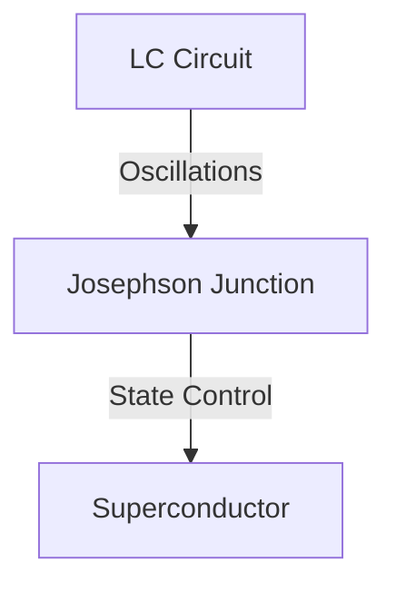

Quantum computing promises to revolutionize technology by tackling complex problems beyond the reach of classical computers. The heart of this innovation is the **qubit**—a quantum bit that can exist in multiple states simultaneously due to the principle of **superposition**. But how do we create a qubit? This guide dives into the intricate process of fabricating qubits, focusing on artificial atoms and the transmon qubit, which is popular in quantum processors built by tech giants like IBM and Google.

## Understanding Quantum Superposition and Qubits

A classical computer relies on bits, which switch between states **0** and **1** to encode information. In contrast, a **qubit** can exist in a superposition of both **0** and **1**, enabling it to represent multiple values simultaneously. Mathematically, a qubit’s state can be represented as:

$$
|\psi\rangle = \alpha |0\rangle + \beta |1\rangle
$$

where:
- \( \alpha \) and \( \beta \) are complex numbers representing the probabilities of the qubit being in states **0** and **1**.
- \( |\alpha|^2 + |\beta|^2 = 1 \), ensuring total probability is conserved.

This quantum superposition offers unprecedented processing power as it allows quantum computers to explore multiple solutions simultaneously.

## Building a Qubit: Requirements and Challenges

Creating a qubit involves a delicate balance of **quantum states**, **coherence**, and **measurement**:

1. **Two-State System**: A qubit must exhibit two distinct states, typically represented as **0** and **1**. This can be achieved with specific **energy levels** within atomic or artificial systems.
2. **Coherence**: The qubit must maintain its superposition long enough to perform calculations. This coherence time acts like the qubit's lifespan, within which it can perform useful operations.
3. **Manipulation**: We need the ability to manipulate the qubit’s state—moving from **0** to **1** or vice versa with precision.
4. **Measurement**: Finally, to extract useful information, we need to measure the qubit, which collapses its state into a definite **0** or **1**.

### Coherence Time

Coherence time, or the qubit’s operational lifespan, is critical. It defines the duration the qubit can stay in a superposition without losing information due to external interference. 

$$
T_2 \propto \frac{1}{\gamma}
$$

where:
- \( T_2 \) is the coherence time,
- \( \gamma \) represents the rate of decoherence (loss of quantum state information).

## Fabricating a Qubit: From Atoms to Artificial Atoms

**Atomic Qubits** were initially considered, where a single trapped atom serves as the qubit. However, controlling individual atoms and scaling them for large quantum computers posed practical limitations, leading researchers to pursue **artificial atoms**.

### Artificial Atoms: The Transmon Qubit

The **transmon qubit** is a type of artificial atom widely used in superconducting quantum computers. It comprises an **LC circuit**—a capacitor and inductor system. When connected with superconducting materials, this circuit exhibits quantum oscillations, crucial for qubit formation.

---

## The Role of the Josephson Junction in Qubit Design

A pivotal innovation in transmon qubit design is the **Josephson junction**, where a thin insulating layer separates two superconductors. This structure enables unique quantum properties that stabilize qubit states.

### Quantum Circuit with Josephson Junction

In a transmon qubit, the Josephson junction adds an inductive element, creating a modified **LC circuit** that oscillates at specific frequencies based on the qubit's state. By applying a microwave pulse, we can manipulate the qubit's state, ensuring it remains in the desired **0** or **1** configuration.

Here’s a simplified circuit model:

The **Josephson junction** effectively tunes the energy levels, creating distinct states for **0** and **1** without interference from higher states. This selective control is achieved by managing the current and magnetic fields across the junction, allowing precise qubit manipulation.

## Measurement in Quantum Circuits

Reading a qubit's state involves coupling it to a measurement circuit, which translates its quantum state into classical information. In transmon qubits, this is often done by attaching the qubit to a **resonator** circuit. The resonator’s frequency shifts based on the qubit’s state, enabling indirect measurement.

### Measurement Formula

The resonator's frequency shift, \( \Delta f \), depends on the qubit's energy level difference:

$$
\Delta f = \frac{g^2}{\omega - \omega_r}
$$

where:
- \( g \) is the coupling strength,
- \( \omega \) is the qubit’s frequency,
- \( \omega_r \) is the resonator frequency.

By observing \( \Delta f \), we can determine whether the qubit is in state **0** or **1**.

## Scaling Challenges: Coherence and Connectivity

Building quantum computers with millions of qubits requires overcoming significant challenges in **coherence** and **connectivity**. Adding each new qubit increases the system’s complexity exponentially, making it difficult to maintain coherence across the entire processor.

### Majorana Qubits: A Future Alternative

An alternative to transmon qubits is the **Majorana qubit**, which offers **topological protection**. These qubits are less sensitive to local noise, enhancing stability. However, creating stable Majorana states remains an experimental endeavor.

---
The fabrication of qubits, especially transmon qubits with Josephson junctions, is a sophisticated process that has enabled the rapid advancement of quantum computing. By understanding the intricate details of qubit design, coherence, and measurement, we are one step closer to realizing practical quantum computers. The future may hold even more stable alternatives, like Majorana qubits, that could push the boundaries of quantum technology further.

For now, the transmon remains a cornerstone of quantum processing, turning quantum computing from theory into reality.
